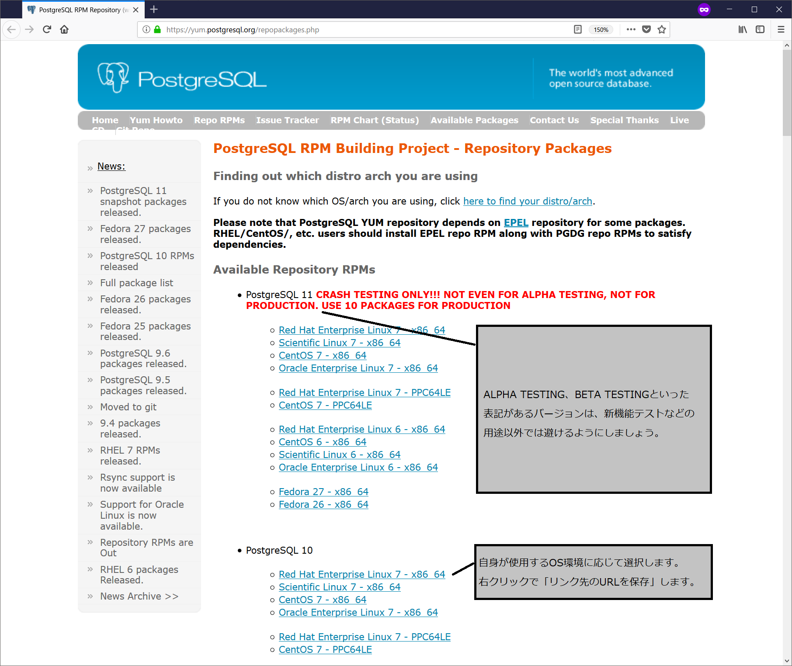
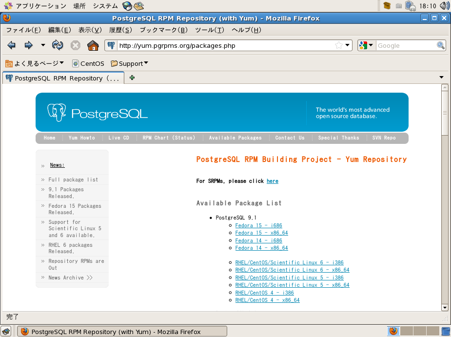
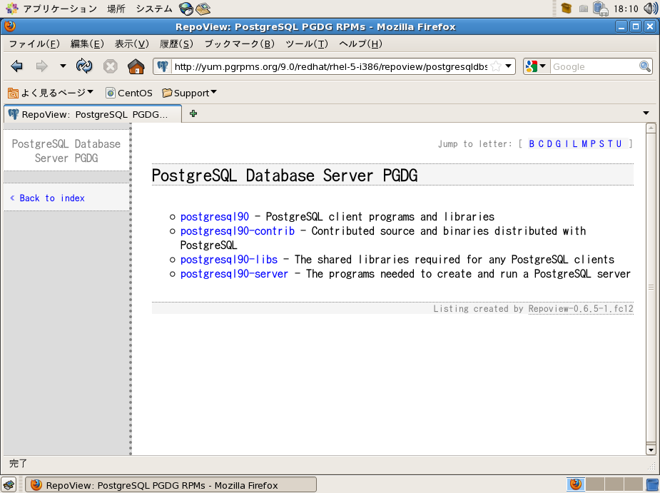
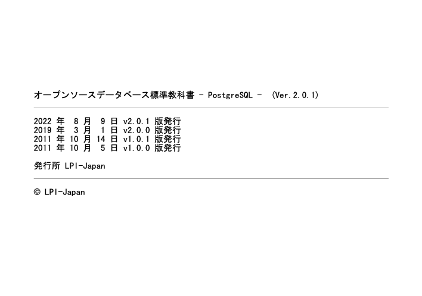

# 実習環境の構築方法
## OSのインストール
本書ではLinuxディストリビューションはCentOS 7.4 64ビット版を使用しています。インストール手順には特別なところはありませんので、インストーラーのデフォルト設定でインストールします。

### OSユーザーの作成
yumやRPMでPostgreSQLをインストールすると、OSユーザー postgres が内部的に作成され各プログラムの実行権限が付与されます。この postgres ユーザーをあらかじめ作成しておくことで、OSユーザーとしての設定（ホームディレクトリや環境変数など）の管理がしやすくなりますので本書ではそのように進めます。

以下ではuseraddコマンドでOSユーザー postgres を作成、passwdコマンドでユーザーのパスワードを設定しています。その後、postgresユーザーにログインしてプロンプトの表示やホームディレクトリ位置を確認し、ログアウトしておきます。
``` {.haskell}
[root@localhost ~]# useradd postgres
[root@localhost ~]# passwd postgres
ユーザー postgres のパスワードを変更。
新しいパスワード:
新しいパスワードを再入力してください:
passwd: すべての認証トークンが正しく更新できました。
[root@localhost ~]# su - postgres
[postgres@localhost ~]$ pwd
/home/postgres
[postgres@localhost ~]$ exit
[root@localhost ~]#
```

### セキュリティの設定
セキュリティの設定では、外部からの攻撃などを受けない環境であることを確認した上で、ファイアーウォールやSELinuxは無効にしていることを想定しています。
``` {.haskell}
[root@localhost ~]# setenforce 0
[root@localhost ~]# systemctl stop firewalld.service
```

## PostgreSQLのインストール
CentOSではPostgreSQL のバージョン10が標準で提供されていないので、yumの外部リポジトリを利用して、PostgreSQL 10をインストールします。本書では2018年1月現在の最新版、PostgreSQL 10.1 をインストールします。

### 手順1　yumリポジトリの設定
PostgreSQLの最新版はPostgreSQL開発コミュニティ内のPostgreSQL RPM Building Projectにより配布されています。webブラウザで以下のURLにアクセスすると現在サポートされているバージョンのyumリポジトリ設定用のRPMパッケージが配布されています。

PostgreSQL RPM Building Project
* https://yum.postgresql.org/repopackages.php

注意： 開発中の最新版（α版、β版やRC版）が同ページで配布されていることがありますが、不具合修正の後、数か月後に正式リリースされるものですので、新機能検証などの目的以外では利用しないことを推奨します。



利用するOSディストリビューションに対応したリンクを右クリックし、リンクのURLをコピーしておきます。例えば、CentOS 7系、PostgreSQL 10では、以下のようなRPMパッケージが直接リンクされています。
https://download.postgresql.org/pub/repos/yum/10/redhat/rhel-7-x86_64/pgdg-centos10-10-2.noarch.rpm

これをLinuxサーバー上の`yum install`コマンドで指定します。
``` {.haskell}
[root@localhost ~]# yum install https://download.postgresql.org/pub/repos/yum/10/redhat/rhel-7-x86_64/pgdg-centos10-10-2.noarch.rpm
読み込んだプラグイン:fastestmirror, langpacks
pgdg-centos10-10-2.noarch.rpm                                                                     | 4.6 kB  00:00:00

（中略）

Is this ok [y/d/N]: y
Downloading packages:
Running transaction check
Running transaction test
Transaction test succeeded
Running transaction
  インストール中          : pgdg-centos10-10-2.noarch                                                                1/1
  検証中                  : pgdg-centos10-10-2.noarch                                                                1/1

インストール:
  pgdg-centos10.noarch 0:10-2

完了しました!
```

### 手順2　PostgreSQLのインストール
手順1でPostgreSQL 10のyumリポジトリが利用できるようになりましたので、必要なパッケージを指定してインストールします。

``` {.haskell}
[root@localhost ~]# yum install postgresql10 postgresql10-server postgresql10-contrib postgresql10-devel
読み込んだプラグイン:fastestmirror, langpacks
pgdg10                                                                          | 4.1 kB  00:00:00
(1/2): pgdg10/7/x86_64/group_gz                                                 |  245 B  00:00:01
(2/2): pgdg10/7/x86_64/primary_db                                               | 145 kB  00:00:01
Loading mirror speeds from cached hostfile
 * base: ftp.iij.ad.jp
 * extras: ftp.iij.ad.jp
 * updates: ftp.iij.ad.jp
依存性の解決をしています
--> トランザクションの確認を実行しています。
---> パッケージ postgresql10.x86_64 0:10.1-1PGDG.rhel7 を インストール
--> 依存性の処理をしています: postgresql10-libs(x86-64) = 10.1-1PGDG.rhel7 のパッケージ: postgresql10-10.1-1PGDG.rhel7.x86_64
--> 依存性の処理をしています: libpq.so.5()(64bit) のパッケージ: postgresql10-10.1-1PGDG.rhel7.x86_64
---> パッケージ postgresql10-contrib.x86_64 0:10.1-1PGDG.rhel7 を インストール
---> パッケージ postgresql10-devel.x86_64 0:10.1-1PGDG.rhel7 を インストール
--> 依存性の処理をしています: libicu-devel のパッケージ: postgresql10-devel-10.1-1PGDG.rhel7.x86_64
---> パッケージ postgresql10-server.x86_64 0:10.1-1PGDG.rhel7 を インストール
--> トランザクションの確認を実行しています。
---> パッケージ libicu-devel.x86_64 0:50.1.2-15.el7 を インストール
---> パッケージ postgresql10-libs.x86_64 0:10.1-1PGDG.rhel7 を インストール
--> 依存性解決を終了しました。

依存性を解決しました

================================================================================================
 Package                             アーキテクチャー    バージョン         リポジトリー   容量
================================================================================================
インストール中:
 postgresql10                        x86_64              10.1-1PGDG.rhel7    pgdg10        1.5 M
 postgresql10-contrib                x86_64              10.1-1PGDG.rhel7    pgdg10        587 k
 postgresql10-devel                  x86_64              10.1-1PGDG.rhel7    pgdg10        2.0 M
 postgresql10-server                 x86_64              10.1-1PGDG.rhel7    pgdg10        4.3 M
依存性関連でのインストールをします:
 libicu-devel                        x86_64              50.1.2-15.el7       base          702 k
 postgresql10-libs                   x86_64              10.1-1PGDG.rhel7    pgdg10        347 k

トランザクションの要約
================================================================================================
インストール  4 パッケージ (+2 個の依存関係のパッケージ)

総ダウンロード容量: 9.3 M
インストール容量: 40 M
Is this ok [y/d/N]: y
Downloading packages:
警告: /var/cache/yum/x86_64/7/base/packages/libicu-devel-50.1.2-15.el7.x86_64.rpm: ヘッダー V3 RSA/SHA256 Signature、鍵 ID f4a80eb5: NOKEY
libicu-devel-50.1.2-15.el7.x86_64.rpm の公開鍵がインストールされていません
(1/6): libicu-devel-50.1.2-15.el7.x86_64.rpm                                  | 702 kB  00:00:00
(2/6): postgresql10-contrib-10.1-1PGDG.rhel7.x86_64.rpm                       | 587 kB  00:00:02
(3/6): postgresql10-10.1-1PGDG.rhel7.x86_64.rpm                               | 1.5 MB  00:00:03
(4/6): postgresql10-libs-10.1-1PGDG.rhel7.x86_64.rpm                          | 347 kB  00:00:00
(5/6): postgresql10-devel-10.1-1PGDG.rhel7.x86_64.rpm                         | 2.0 MB  00:00:01
(6/6): postgresql10-server-10.1-1PGDG.rhel7.x86_64.rpm                        | 4.3 MB  00:00:03
-----------------------------------------------------------------------------------------------------
合計                                                                 1.4 MB/s | 9.3 MB  00:00:06
file:///etc/pki/rpm-gpg/RPM-GPG-KEY-CentOS-7 から鍵を取得中です。
Importing GPG key 0xF4A80EB5:
 Userid     : "CentOS-7 Key (CentOS 7 Official Signing Key) <security@centos.org>"
 Fingerprint: 6341 ab27 53d7 8a78 a7c2 7bb1 24c6 a8a7 f4a8 0eb5
 Package    : centos-release-7-4.1708.el7.centos.x86_64 (@anaconda)
 From       : /etc/pki/rpm-gpg/RPM-GPG-KEY-CentOS-7
上記の処理を行います。よろしいでしょうか？ [y/N]y
Running transaction check
Running transaction test
Transaction test succeeded
Running transaction
  インストール中          : postgresql10-libs-10.1-1PGDG.rhel7.x86_64                        1/6
  インストール中          : postgresql10-10.1-1PGDG.rhel7.x86_64                             2/6
  インストール中          : libicu-devel-50.1.2-15.el7.x86_64                                3/6
  インストール中          : postgresql10-devel-10.1-1PGDG.rhel7.x86_64                       4/6
  インストール中          : postgresql10-server-10.1-1PGDG.rhel7.x86_64                      5/6
  インストール中          : postgresql10-contrib-10.1-1PGDG.rhel7.x86_64                     6/6
  検証中                  : postgresql10-server-10.1-1PGDG.rhel7.x86_64                      1/6
  検証中                  : postgresql10-libs-10.1-1PGDG.rhel7.x86_64                        2/6
  検証中                  : postgresql10-devel-10.1-1PGDG.rhel7.x86_64                       3/6
  検証中                  : postgresql10-contrib-10.1-1PGDG.rhel7.x86_64                     4/6
  検証中                  : libicu-devel-50.1.2-15.el7.x86_64                                5/6
  検証中                  : postgresql10-10.1-1PGDG.rhel7.x86_64                             6/6

インストール:
  postgresql10.x86_64 0:10.1-1PGDG.rhel7             postgresql10-contrib.x86_64 0:10.1-1PGDG.rhel7
  postgresql10-devel.x86_64 0:10.1-1PGDG.rhel7       postgresql10-server.x86_64 0:10.1-1PGDG.rhel7

依存性関連をインストールしました:
  libicu-devel.x86_64 0:50.1.2-15.el7                postgresql10-libs.x86_64 0:10.1-1PGDG.rhel7

完了しました!
```

インストールが完了すると、以下の通りディレクトリとバイナリが配置されています。
``` {.haskell}
[postgres@localhost ~]$ ls /usr/pgsql-10/
bin  doc  include  lib  share
[postgres@localhost ~]$ ls /usr/pgsql-10/bin
clusterdb   ecpg               pg_config       pg_isready      pg_rewind       pg_waldump                  postmaster
createdb    initdb             pg_controldata  pg_receivewal   pg_standby      pgbench                     psql
createuser  oid2name           pg_ctl          pg_recvlogical  pg_test_fsync   postgres                    reindexdb
dropdb      pg_archivecleanup  pg_dump         pg_resetwal     pg_test_timing  postgresql-10-check-db-dir  vacuumdb
dropuser    pg_basebackup      pg_dumpall      pg_restore      pg_upgrade      postgresql-10-setup         vacuumlo
```

### 手順3　PostgreSQL利用環境の初期設定
インストール直後はデータベースが作成されておらず、次のステップ以降で利用者が作成します。インストールしたPostgreSQLは、OSユーザー postgres が初期化ユーザーとして管理権限を持っているので、suコマンドでユーザーpostgresに変更して操作を行います。PostgreSQLに対する各種操作がしやすいようにOS側の設定を行います。
なお、データディレクトリの位置はデータベース作成時に指定できますが、その際に本項の設定（環境変数と起動スクリプト）が正しく設定されている必要があります。本書ではデフォルトの位置（/var/lib/pgsql/10/data）に作成することとします。

#### 環境変数の設定

環境変数 | 説明
---------- | ------------------------------------------------------
PGDATA | データディレクトリ位置を指定します。
PGHOME | PostgreSQLのインストールディレクトリを指定します。
PATH | PostgreSQLインストールディレクトリ配下のbinを指定します。

以下では、postgresqlユーザーの環境変数設定ファイル .bash_profile を編集し、PGDATA、PGHOME、PATH環境変数を追加しています。
``` {.haskell}
[root@localhost ~]# su - postgres
[postgres@localhost ~]$ vi .bash_profile
---------
# .bash_profile

# Get the aliases and functions
if [ -f ~/.bashrc ]; then
        . ~/.bashrc
fi

# User specific environment and startup programs

PATH=$PATH:$HOME/.local/bin:$HOME/bin

export PATH

### edit for PostgreSQL 10
export PGDATA=/var/lib/pgsql/10/data
export PGHOME=/usr/pgsql-10
export PATH=$PGHOME/bin:.:$PATH
-------
[postgres@localhost ~]$ source .bash_profile
```

#### 起動スクリプトの確認
yumやRPMでPostgreSQLをインストールすると、起動停止スクリプトが自動作成されます。先の手順で設定した環境変数PGDATAが Location of database directory と一致していることを確認します。本書の範囲では変更する必要はありません。
``` {.haskell}
[root@localhost ~]# vi /usr/lib/systemd/system/postgresql-10.service
------
# Location of database directory
Environment=PGDATA=/var/lib/pgsql/10/data/
------
```

### 参考　yumを使わないインストール
インターネットへの接続が行えないなどの制限がある場合には、Webサイトから以下のパッケージをダウンロードしてサーバーに配置し、RPMコマンドでインストールしてください。

##### ダウンロード Webページ
http://yum.pgrpms.org/packages.php



##### CentOS 7 64ビット版用ダウンロード Webページ
https://yum.postgresql.org/10/redhat/rhel-7-x86_64/repoview/postgresqldbserver10.group.html



以下のパッケージをダウンロードしサーバーに配置します。

パッケージ名 | 説明
--------------------- | -------------------------------------------------------
postgresql10 | PostgreSQLを利用する上で必須のクライアントプログラムやライブラリ
postgresql10-libs | PostgreSQLを利用する上で必須の共有ライブラリ
postgresql10-server | サーバープログラムの本体
postgresql10-contrib | 拡張機能（本書の範囲では必須ではありません）

各パッケージのリンク先にはさらに複数マイナーバージョンが配布されている場合があります。本書ではいずれも10.1を利用しています。

#### RPMコマンドでインストール
実際にダウンロードするファイルは`postgresql10-10.1-1PGDG.rhel7.x86_64.rpm`のようなRPM形式です。RPMコマンドでインストールします。postgresql10-libs、postgresql10-server、postgresql10-contribも同様にインストールします。
``` {.haskell}
[root@localhost ~]# cd <ファイル配置先ディレクトリ>
[root@localhost ~]# rpm -ivh postgresql10-10.1-1PGDG.rhel7.x86_64.rpm
```


## データベースの初期化
データベースクラスタを作成します。この作業をデータベースの初期化と呼び、インストール後に1回だけ行います。

### データベースクラスタとinitdbコマンド
PostgreSQLが管理するデータベースそのもの（実体はOS上のファイル）や各種設定ファイル、変更履歴ファイル、ログファイルなどをひとまとめにしたものをデータベースクラスタと呼びます。初期化とはデータベースクラスタを構成するすべてのファイルやディレクトリを新規作成することを指します。
データベースの初期化は`initdb`コマンドを使用し、日本語環境で利用するうえで推奨されている`-E utf8`および`--no-locale`オプションを指定してデータベースを初期化します。

### データディレクトリ
データベースクラスタを構成するすべてのファイルやディレクトリは1つのディレクトリ配下にまとめて配置されます。このディレクトリをデータディレクトリと呼び、環境変数PGDATAで指定されます。
initdb時、環境変数PGDATAが参照され、ここで指定した位置にデータベースクラスタが作成されます。

### initdbコマンドの実行
以下の例では、前述の手順の従ってデータディレクトリ位置が環境変数PGDATAに設定された状態でinitdbコマンドを実行しています。initdb完了後、`cd`コマンドでデータディレクトリに移動し、作成されたファイルを確認しています。
``` {.haskell}
[postgres@localhost ~]$ env | grep PGDATA
PGDATA=/var/lib/pgsql/10/data
[postgres@localhost ~]$ initdb -E utf8 --no-locale
データベースシステム内のファイルの所有者は"postgres"ユーザでした。
このユーザがサーバプロセスを所有しなければなりません。

データベースクラスタはロケール"C"で初期化されます。
デフォルトのテキスト検索設定はenglishに設定されました。

データベージのチェックサムは無効です。

ディレクトリ/var/lib/pgsql/10/dataの権限を設定しています ... ok
サブディレクトリを作成しています ... ok
デフォルトのmax_connectionsを選択しています ... 100
デフォルトの shared_buffers を選択しています ... 128MB
selecting dynamic shared memory implementation ... posix
設定ファイルを作成しています ... ok
running bootstrap script ... ok
performing post-bootstrap initialization ... ok
データをディスクに同期しています...ok

警告: ローカル接続向けに"trust"認証が有効です。
pg_hba.confを編集する、もしくは、次回initdbを実行する時に-Aオプショ
ン、または、--auth-localおよび--auth-hostを使用することで変更するこ
とができます。

Success. You can now start the database server using:

    pg_ctl -D /var/lib/pgsql/10/data -l logfile start

[postgres@localhost ~]$ cd $PGDATA
[postgres@localhost data]$ ls
PG_VERSION  pg_commit_ts  pg_ident.conf  pg_notify    pg_snapshots  pg_subtrans  pg_wal                postgresql.conf
base        pg_dynshmem   pg_logical     pg_replslot  pg_stat       pg_tblspc    pg_xact
global      pg_hba.conf   pg_multixact   pg_serial    pg_stat_tmp   pg_twophase  postgresql.auto.conf
```

## データベースを起動
PostgreSQLの起動・停止には`systemctl`コマンドを使用します。
``` {.haskell}
[root@localhost ~]# systemctl start postgresql-10.service
```

PostgreSQLが正しく起動されている場合、ステータスは以下のようになります。
``` {.haskell}
[root@localhost ~]# systemctl status postgresql-10.service
● postgresql-10.service - PostgreSQL 10 database server
   Loaded: loaded (/usr/lib/systemd/system/postgresql-10.service; disabled; vendor preset: disabled)
   Active: active (running) since 月 2018-01-22 01:59:14 JST; 6s ago
     Docs: https://www.postgresql.org/docs/10/static/
  Process: 22602 ExecStartPre=/usr/pgsql-10/bin/postgresql-10-check-db-dir ${PGDATA} (code=exited, status=0/SUCCESS)
 Main PID: 22611 (postmaster)
   CGroup: /system.slice/postgresql-10.service
           tq22611 /usr/pgsql-10/bin/postmaster -D /var/lib/pgsql/10/data/
           tq22614 postgres: logger process
           tq22616 postgres: checkpointer process
           tq22617 postgres: writer process
           tq22618 postgres: wal writer process
           tq22619 postgres: autovacuum launcher process
           tq22620 postgres: stats collector process
           mq22621 postgres: bgworker: logical replication launcher
（以下略）
```

デフォルトでは手動起動になっているので、システムの起動毎に自動的に起動したい場合にはsystemctlで`enable`サブコマンドを指定します。自動起動を無効にする場合は`disable`を指定します。
``` {.haskell}
[root@localhost ~]# systemctl enable postgresql-10.service
Created symlink from /etc/systemd/system/multi-user.target.wants/postgresql-10.service to /usr/lib/systemd/system/postgresql-10.service.
[root@localhost ~]# systemctl list-unit-files | grep postgres
postgresql-10.service                         enabled
```

## 動作の確認
データベースの動作確認を行います。PostgreSQLサーバーに対するすべての操作はpostgresユーザーで実施します。
``` {.haskell}
[root@localhost ~]# su - postgres
```

psqlに-lオプションを付けて実行し、作成されているデータベースを確認します。
``` {.haskell}
[postgres@localhost ~]$ psql -l
                             List of databases
   Name    |  Owner   | Encoding | Collate | Ctype |   Access privileges
-----------+----------+----------+---------+-------+-----------------------
 postgres  | postgres | UTF8     | C       | C     |
 template0 | postgres | UTF8     | C       | C     | =c/postgres          +
           |          |          |         |       | postgres=CTc/postgres
 template1 | postgres | UTF8     | C       | C     | =c/postgres          +
           |          |          |         |       | postgres=CTc/postgres
(3 rows)
```

\pagebreak

# 付録　実習の準備方法
実習で使用するデータベースを作成し、データベースに接続します。そして、表を作成し、初期データを入力します。

## データベースの作成
実習用のデータベースossdbを作成します。データベースの作成はOSユーザーpostgresで行います。作成後、接続できることを確認しておきます。
``` {.haskell}
[root@localhost ~]# su - postgres
[postgres@localhost ~]$ createdb ossdb
[postgres@localhost ~]$ psql ossdb
psql (10.1)
Type "help" for help.

ossdb=#
```

## 表の作成
表を作成します。prod表、customer表、orders表の3つを作成します。

以下のSQL文をpsqlを実行している端末にコピー＆ペーストすれば、必要な表が作成されます。
``` {.haskell}
CREATE TABLE prod
(prod_id   integer,
 prod_name text,
 price     integer);

CREATE TABLE customer
 (customer_id   integer,
  customer_name text);

CREATE TABLE orders
 (order_id    integer,
  order_date  timestamp,
  customer_id integer,
  prod_id     integer,
  qty         integer);
```


以下は実行例です。
``` {.haskell}
ossdb=# CREATE TABLE prod
 (prod_id   integer,
  prod_name text,
  price     integer);
CREATE TABLE
（略）
```

## データの入力
作成した表に初期データを入力します。以下のSQL文をpsqlを実行している端末にコピー＆ペーストすれば、初期データがそれぞれの表に入力されます。

``` {.haskell}
-- 複数行を同時にINSERT
INSERT INTO customer(customer_id,customer_name) VALUES
 (1,'佐藤商事'),
 (2,'鈴木物産'),
 (3,'高橋商店');

INSERT INTO prod(prod_id,prod_name,price) VALUES
 (1,'みかん',50),
 (2,'りんご',70),
 (3,'メロン',100);

-- 一行ずつ個別にINSERTし、now()関数で取得される時刻に差をつける
INSERT INTO orders(order_id,order_date,customer_id,prod_id,qty) VALUES (1,now(),1,1,10);
INSERT INTO orders(order_id,order_date,customer_id,prod_id,qty) VALUES (2,now(),2,2,5);
INSERT INTO orders(order_id,order_date,customer_id,prod_id,qty) VALUES (3,now(),3,3,8);
INSERT INTO orders(order_id,order_date,customer_id,prod_id,qty) VALUES (4,now(),2,1,3);
INSERT INTO orders(order_id,order_date,customer_id,prod_id,qty) VALUES (5,now(),3,2,4);
```

以下は実行例です。
``` {.haskell}
ossdb=# -- 複数行を同時にINSERT
ossdb=# INSERT INTO customer(customer_id,customer_name) VALUES
 (1,'佐藤商事'),
 (2,'鈴木物産'),
 (3,'高橋商店');
INSERT 0 3
（略）
```


\pagebreak

\ 

\vspace{7.5in}


