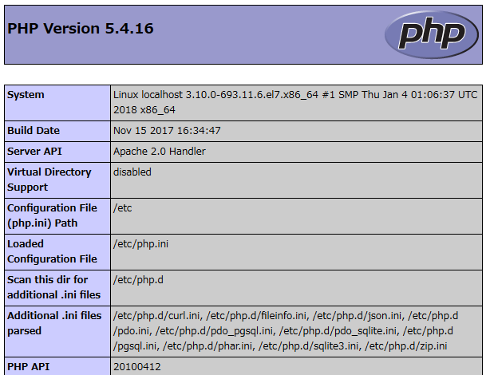
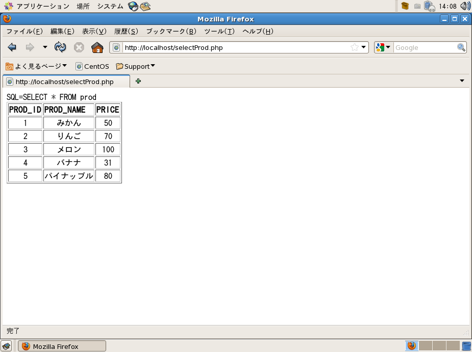
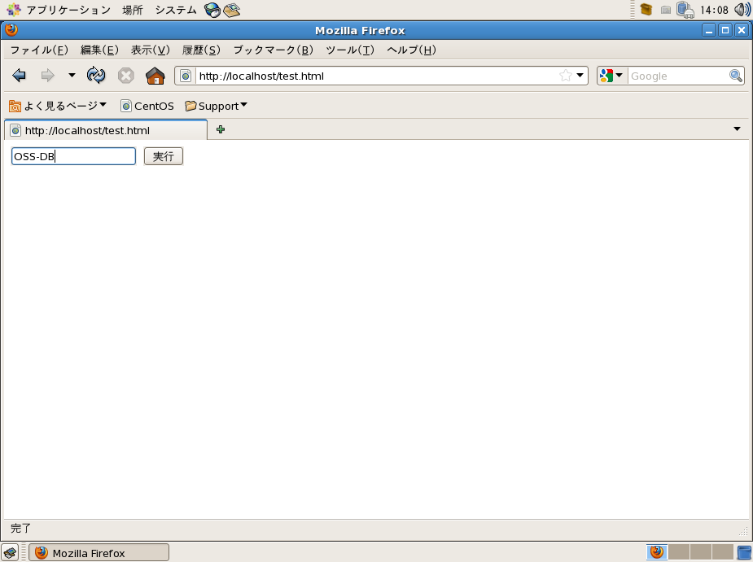
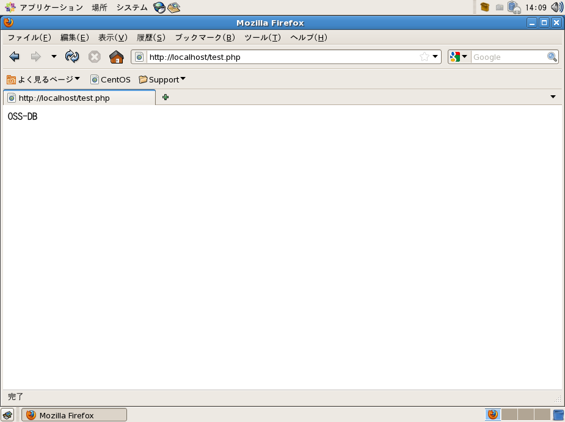
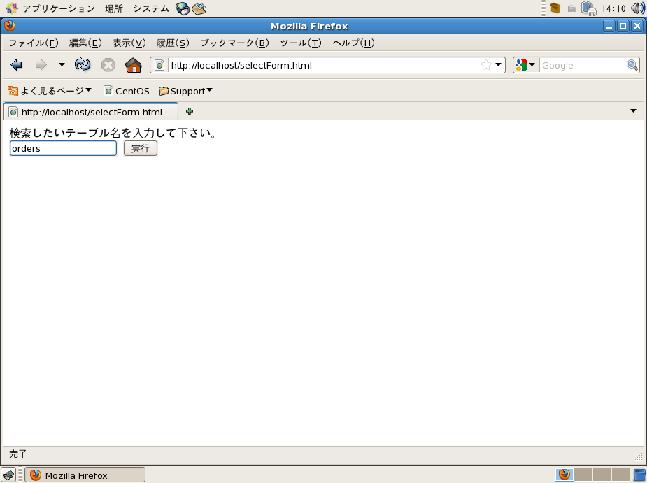
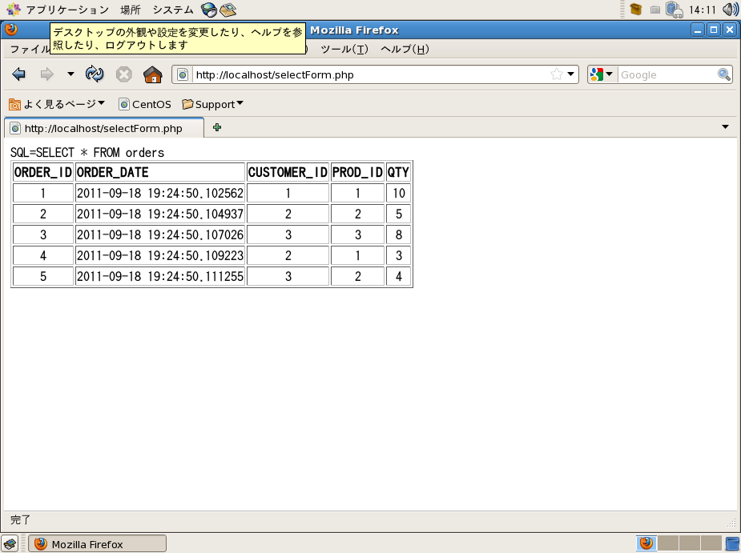

# Webアプリケーションとの連携
データベースの一般的な利用方法として、Webアプリケーションと連携してデータベースでデータの管理を行う形があります。このようにWebアプリケーションの背後で動作するデータベースを「バックエンドデータベース」と呼びます。この章では、Webアプリケーション開発でよく利用されている言語「PHP」との組み合わせでのバックエンドデータベースとしての利用方法を学びます。

## PHPとは？
PHPとは、Webサーバー上で動作するWebアプリケーション開発でよく利用される言語です。HTMLファイルにアプリケーションのコードを埋め込むことができるので、Webページの一部分にアプリケーションの動作を組み込んだりすることができます。

## PHPの動作イメージ
PHPはWebサーバーの「Apache HTTPサーバー（以下、Apache）」に組み込んで利用するモジュールが配布されており、これを利用すると簡単にWebアプリケーションの開発を始められます。Webブラウザから拡張子が.phpになっているファイルを要求されると、そのファイル内に含まれているPHPのコードが実行され、最終的な結果はHTMLとしてWebブラウザに渡されます。


## ApacheとPHP環境の設定
ApacheとPHPを利用できるようにインストールと設定を行います。インストールするのはPostgreSQLが動作しているマシン上でも、別々のマシンでも構いません。別々のマシンにインストールした場合、PHPとPostgreSQLの間はネットワーク経由で接続することになります。ここではPostgreSQLが動作している同じマシンにApacheとPHPをインストールします。

### ApacheとPHPをパッケージでインストール
CentOSではApacheとPHPがRPMパッケージで提供されているので、yumコマンドを使ってインストールします。yumコマンドでインストールが行えない場合には、インストールメディアからrpmコマンドを使って必要なパッケージをインストールします。インストールするパッケージはphpとphp-pgsqlです。

``` {.haskell}
[root@localhost ~]# yum install php php-pgsql
読み込んだプラグイン:fastestmirror, langpacks
base                                                      | 3.6 kB  00:00:00
extras                                                    | 3.4 kB  00:00:00
pgdg10                                                    | 4.1 kB  00:00:00
updates                                                   | 3.4 kB  00:00:00
Loading mirror speeds from cached hostfile
 * base: ftp.iij.ad.jp
 * extras: ftp.iij.ad.jp
 * updates: ftp.iij.ad.jp
依存性の解決をしています
--> トランザクションの確認を実行しています。
---> パッケージ php.x86_64 0:5.4.16-43.el7_4 を インストール
--> 依存性の処理をしています: php-common(x86-64) = 5.4.16-43.el7_4 のパッケージ: php-5.4.16-43.el7_4.x86_64
--> 依存性の処理をしています: php-cli(x86-64) = 5.4.16-43.el7_4 のパッケージ: php-5.4.16-43.el7_4.x86_64
--> 依存性の処理をしています: httpd-mmn = 20120211x8664 のパッケージ: php-5.4.16-43.el7_4.x86_64
--> 依存性の処理をしています: httpd のパッケージ: php-5.4.16-43.el7_4.x86_64
---> パッケージ php-pgsql.x86_64 0:5.4.16-43.el7_4 を インストール
--> 依存性の処理をしています: php-pdo(x86-64) = 5.4.16-43.el7_4 のパッケージ: php-pgsql-5.4.16-43.el7_4.x86_64
--> トランザクションの確認を実行しています。
---> パッケージ httpd.x86_64 0:2.4.6-67.el7.centos.6 を インストール
--> 依存性の処理をしています: httpd-tools = 2.4.6-67.el7.centos.6 のパッケージ: httpd-2.4.6-67.el7.centos.6.x86_64
--> 依存性の処理をしています: /etc/mime.types のパッケージ: httpd-2.4.6-67.el7.centos.6.x86_64
---> パッケージ php-cli.x86_64 0:5.4.16-43.el7_4 を インストール
---> パッケージ php-common.x86_64 0:5.4.16-43.el7_4 を インストール
--> 依存性の処理をしています: libzip.so.2()(64bit) のパッケージ: php-common-5.4.16-43.el7_4.x86_64
---> パッケージ php-pdo.x86_64 0:5.4.16-43.el7_4 を インストール
--> トランザクションの確認を実行しています。
---> パッケージ httpd-tools.x86_64 0:2.4.6-67.el7.centos.6 を インストール
---> パッケージ libzip.x86_64 0:0.10.1-8.el7 を インストール
---> パッケージ mailcap.noarch 0:2.1.41-2.el7 を インストール
--> 依存性解決を終了しました。

依存性を解決しました

================================================================================================
 Package                     アーキテクチャー    バージョン                リポジトリー   容量
================================================================================================
インストール中:
 php                         x86_64              5.4.16-43.el7_4           updates        1.4 M
 php-pgsql                   x86_64              5.4.16-43.el7_4           updates         86 k
依存性関連でのインストールをします:
 httpd                       x86_64              2.4.6-67.el7.centos.6     updates        2.7 M
 httpd-tools                 x86_64              2.4.6-67.el7.centos.6     updates         88 k
 libzip                      x86_64              0.10.1-8.el7              base            48 k
 mailcap                     noarch              2.1.41-2.el7              base            31 k
 php-cli                     x86_64              5.4.16-43.el7_4           updates        2.7 M
 php-common                  x86_64              5.4.16-43.el7_4           updates        565 k
 php-pdo                     x86_64              5.4.16-43.el7_4           updates         98 k

トランザクションの要約
================================================================================================
インストール  2 パッケージ (+7 個の依存関係のパッケージ)

総ダウンロード容量: 7.7 M
インストール容量: 27 M
Is this ok [y/d/N]: y
Downloading packages:
(1/9): libzip-0.10.1-8.el7.x86_64.rpm                                         |  48 kB  00:00:01
(2/9): mailcap-2.1.41-2.el7.noarch.rpm                                        |  31 kB  00:00:01
(3/9): httpd-tools-2.4.6-67.el7.centos.6.x86_64.rpm                           |  88 kB  00:00:01
(4/9): php-5.4.16-43.el7_4.x86_64.rpm                                         | 1.4 MB  00:00:01
(5/9): httpd-2.4.6-67.el7.centos.6.x86_64.rpm                                 | 2.7 MB  00:00:02
(6/9): php-pdo-5.4.16-43.el7_4.x86_64.rpm                                     |  98 kB  00:00:00
(7/9): php-common-5.4.16-43.el7_4.x86_64.rpm                                  | 565 kB  00:00:00
(8/9): php-pgsql-5.4.16-43.el7_4.x86_64.rpm                                   |  86 kB  00:00:00
(9/9): php-cli-5.4.16-43.el7_4.x86_64.rpm                                     | 2.7 MB  00:00:00
-------------------------------------------------------------------------------------------------
合計                                                                 3.1 MB/s | 7.7 MB  00:00:02
Running transaction check
Running transaction test
Transaction test succeeded
Running transaction
  インストール中          : libzip-0.10.1-8.el7.x86_64                                     1/9
  インストール中          : php-common-5.4.16-43.el7_4.x86_64                              2/9
  インストール中          : php-cli-5.4.16-43.el7_4.x86_64                                 3/9
  インストール中          : php-pdo-5.4.16-43.el7_4.x86_64                                 4/9
  インストール中          : httpd-tools-2.4.6-67.el7.centos.6.x86_64                       5/9
  インストール中          : mailcap-2.1.41-2.el7.noarch                                    6/9
  インストール中          : httpd-2.4.6-67.el7.centos.6.x86_64                             7/9
  インストール中          : php-5.4.16-43.el7_4.x86_64                                     8/9
  インストール中          : php-pgsql-5.4.16-43.el7_4.x86_64                               9/9
  検証中                  : php-cli-5.4.16-43.el7_4.x86_64                                 1/9
  検証中                  : php-common-5.4.16-43.el7_4.x86_64                              2/9
  検証中                  : php-5.4.16-43.el7_4.x86_64                                     3/9
  検証中                  : php-pgsql-5.4.16-43.el7_4.x86_64                               4/9
  検証中                  : mailcap-2.1.41-2.el7.noarch                                    5/9
  検証中                  : httpd-2.4.6-67.el7.centos.6.x86_64                             6/9
  検証中                  : httpd-tools-2.4.6-67.el7.centos.6.x86_64                       7/9
  検証中                  : libzip-0.10.1-8.el7.x86_64                                     8/9
  検証中                  : php-pdo-5.4.16-43.el7_4.x86_64                                 9/9

インストール:
  php.x86_64 0:5.4.16-43.el7_4          php-pgsql.x86_64 0:5.4.16-43.el7_4

依存性関連をインストールしました:
  httpd.x86_64 0:2.4.6-67.el7.centos.6  httpd-tools.x86_64 0:2.4.6-67.el7.centos.6
  libzip.x86_64 0:0.10.1-8.el7          mailcap.noarch 0:2.1.41-2.el7
  php-cli.x86_64 0:5.4.16-43.el7_4      php-common.x86_64 0:5.4.16-43.el7_4
  php-pdo.x86_64 0:5.4.16-43.el7_4

完了しました!
```

### Apache+PHPの設定とテスト
インストールが終わったら、動作テストを行います。  
テスト用のPHPを埋め込んだファイルindex.phpを、ApacheがHTMLファイルを参照する/var/www/htmlディレクトリに作成します。
``` {.haskell}
[root@localhost ~]# echo "<?php phpinfo(); ?>" > /var/www/html/index.php
[root@localhost ~]# cat /var/www/html/index.php
<?php phpinfo(); ?>
```

Webサーバーを起動します。  
以下の例では、systemctlのサブコマンドlist-unit-filesでhttpdの起動に用いるサービス名を確認し、startでサービスを起動、statusやpsコマンドで正常に起動したことを確認しています。
``` {.haskell}
[root@localhost ~]# systemctl list-unit-files | grep httpd
httpd.service                                 disabled
[root@localhost ~]# systemctl start httpd.service
[root@localhost ~]# systemctl status httpd.service
● httpd.service - The Apache HTTP Server
   Loaded: loaded (/usr/lib/systemd/system/httpd.service; disabled; vendor preset: disabled)
   Active: active (running) since 月 2018-02-05 04:31:17 JST; 7s ago
     Docs: man:httpd(8)
           man:apachectl(8)
 Main PID: 6807 (httpd)
   Status: "Processing requests..."
   CGroup: /system.slice/httpd.service
           tq6807 /usr/sbin/httpd -DFOREGROUND
           tq6809 /usr/sbin/httpd -DFOREGROUND
           tq6810 /usr/sbin/httpd -DFOREGROUND
           tq6811 /usr/sbin/httpd -DFOREGROUND
           tq6812 /usr/sbin/httpd -DFOREGROUND
           mq6814 /usr/sbin/httpd -DFOREGROUND

 2月 05 04:31:16 localhost systemd[1]: Starting The Apache HTTP Server...
 2月 05 04:31:17 localhost httpd[6807]: AH00558: httpd: Could not reliably determine the server's fully qualifie...ssage
 2月 05 04:31:17 localhost systemd[1]: Started The Apache HTTP Server.
Hint: Some lines were ellipsized, use -l to show in full.
[root@localhost ~]# ps ax | grep httpd
 6807 ?        Ss     0:00 /usr/sbin/httpd -DFOREGROUND
 6809 ?        S      0:00 /usr/sbin/httpd -DFOREGROUND
 6810 ?        S      0:00 /usr/sbin/httpd -DFOREGROUND
 6811 ?        S      0:00 /usr/sbin/httpd -DFOREGROUND
 6812 ?        S      0:00 /usr/sbin/httpd -DFOREGROUND
 6814 ?        S      0:00 /usr/sbin/httpd -DFOREGROUND
 6825 pts/0    S+     0:00 grep --color=auto httpd
```

ブラウザでWebサーバーに接続します。ApacheやPHP、PostgreSQLが動作しているマシン上でFirefoxなどのWebブラウザを起動し、以下のアドレスを入力してアクセスします。
``` {.haskell}
http://localhost/
```

同じマシンでWebブラウザを実行できない場合には、別のマシンからWebサーバーに接続してください。

上記URLにアクセスすると、index.phpに書いておいたphpinfo()関数が実行され、インストールされているPHPの詳細な情報がWebページで表示されます。



## PHPとPostgreSQLの連携
PHPからPostgreSQLに接続し、データを取得してHTMLファイルに組み込む簡単なアプリケーションを作成します。
サンプルアプリケーションを作成して、実行してみましょう。サンプルで使用しているPHPで用意されたPostgreSQL用の関数は以下の通りです。

#### サンプルで使用しているPostgreSQL用関数
関数名 | 説明
------------------ | --------------------------
pg_connect() | PostgreSQLに接続します。
pg_query() | SQLを実行します。
pg_last_error() | エラーを取得します。
pg_num_rows() | 行数を取得します。
pg_num_fields() | 列数を取得します。
pg_field_name() | 列名を取得します。
pg_fetch_object() | 行データを取得します。
pg_close() | PostgreSQLとの接続を終了します。

また、使用している他の（PostgreSQL操作以外の）関数は以下の通りです。

関数名 | 説明
------------------- | -------------------------------------------------------------------
htmlspecialchars() | 引数の文字列の中からHTMLで特別な意味を持つ文字を正しく表示可能な形式に変換します。変換されるのは&や<>といった文字です。
strtoupper() | 引数の文字列をすべて大文字にします。

\pagebreak

### データ検索ページの作成
サンプルアプリケーションを作成します。ossdbデータベースにPostgreSQLユーザーpostgresで接続し、SQL文「SELECT * FROM prod」を実行します。実行した結果はHTMLのテーブルとして加工し、Webブラウザで表示します。

以下のサンプルを適当なファイル名（例 selectProd.php）でディレクトリ/var/www/htmlに保存します。作業はユーザーrootで行うか、ディレクトリ/var/www/htmlのパーミッションを変更して適当なユーザーで行ってください。データベースへの接続情報を記述しているpg_connect関数内のパスワードは、各自で設定済みのpostgresユーザーのパスワードに変更してください。

selectProd.php
``` {.haskell}
<html>
<body>
<?php
$dbcon = pg_connect("dbname=ossdb user=postgres password=password");
if (!$dbcon) {
        die("<hr>pg_connect 失敗<hr>");
}
$sql =  "SELECT * FROM prod";
echo  "SQL=$sql<brx>\n";
$result = pg_query ($dbcon, $sql);
if (!$result) {
        pg_last_error($dbcon);
        die( "pg_exec 失敗<hr>");
}
$numrows = pg_num_rows($result);
$fnum = pg_num_fields($result);
echo "<table border>";
echo "<tr>";
for ($x = 0; $x < $fnum; $x++) {
        echo "<td><b>";
        echo htmlspecialchars(strtoupper(pg_field_name($result, $x)));
        echo "</b></td>";
}
echo "</tr>";
for ($i = 0; $i < $numrows; $i++) {
        $row = pg_fetch_object($result, $i);
        echo "<tr align='center'>";
        for ($x = 0; $x < $fnum; $x++) {
                $fieldname = pg_field_name($result, $x);
                echo "<td>";
                echo htmlspecialchars($row->$fieldname);
                echo "</td>";
        }
        echo"</tr>";
}
echo "</table>";
pg_close($dbcon);
?>
</body>
</html>
```

ファイルを作成したら、Webブラウザからアクセスして結果を確認します。
``` {.haskell}
http://localhost/selectProd.php
```



### フォームからのデータの取得方法
HTMLフォームに入力されたデータをPHPで取得するには、$_POST変数を使用します。HTMLフォームからACTIONとして呼び出されたPHPはPOSTメソッドで送信された値を連想配列として保持しています。$_POST変数はこの連想配列にアクセスするための変数です。
動作を確認するために、HTMLフォームのtest.htmlとPHPプログラムtest.phpを/var/www/htmlディレクトリに作成します。

test.html
``` {.haskell}
<html>
<body>
<form action="test.php" method="post">
<input type=text name="foo">
<input type=submit>
</form>
</body>
</html>
```

test.php
``` {.haskell}
<?php
echo htmlspecialchars($_POST['foo']);
?>
```

Webブラウザからtest.htmlを呼び出し、フォームに値を入力して実行ボタンをクリックします。PHPのechoは変数の値を表示する命令ですので、フォームからの値をWebブラウザに表示します。
``` {.haskell}
http://localhost/test.html
```






### フォームからの入力をSQL文に組み込む
PHPでSQL文を実行するには、一度SQL文を文字列変数に代入し、その変数をpg_query関数に渡します。文字列変数に代入する際にフォームからの入力をSQL文に組み込めば、フォーム入力に応じて動作を変更することができます。selectForm.phpではデータベースにアクセスしますので、pg_connect関数内のパスワードは各自で設定したパスワードに変更します。

selectForm.html
``` {.haskell}
<html>
<body>
検索したいテーブル名を入力して下さい。
<form action="selectForm.php" method="post">
<input type=text name="table">
<input type=submit>
</form>
</body>
</html>
```

selectForm.php
``` {.haskell}
<html>
<body>
<?php
$dbcon = pg_connect("dbname=ossdb user=postgres password=password");
if (!$dbcon) {
        die("<hr>pg_connect 失敗<hr>");
}
$table = $_POST['table'];
$sql =  "SELECT * FROM $table";
echo  "SQL=$sql<brx>\n";
$result = pg_query ($dbcon, $sql);
if (!$result) {
        pg_last_error($dbcon);
        die( "pg_exec 失敗<hr>");
}
$numrows = pg_num_rows($result);
$fnum = pg_num_fields($result);
echo "<table border>";
echo "<tr>";
for ($x = 0; $x < $fnum; $x++) {
        echo "<td><b>";
        echo htmlspecialchars(strtoupper(pg_field_name($result, $x)));
        echo "</b></td>";
}
echo "</tr>";
for ($i = 0; $i < $numrows; $i++) {
        $row = pg_fetch_object($result, $i);
        echo "<tr align='center'>";
        for ($x = 0; $x < $fnum; $x++) {
                $fieldname = pg_field_name($result, $x);
                echo "<td>";
                echo htmlspecialchars($row->$fieldname);
                echo "</td>";
        }
        echo"</tr>";
}
echo "</table>";
pg_close($dbcon);
?>
</body>
</html>
```

作成したフォームにアクセスし、検索したい表の名前を入力します。
``` {.haskell}
http://localhost/selectForm.html
```





\pagebreak
