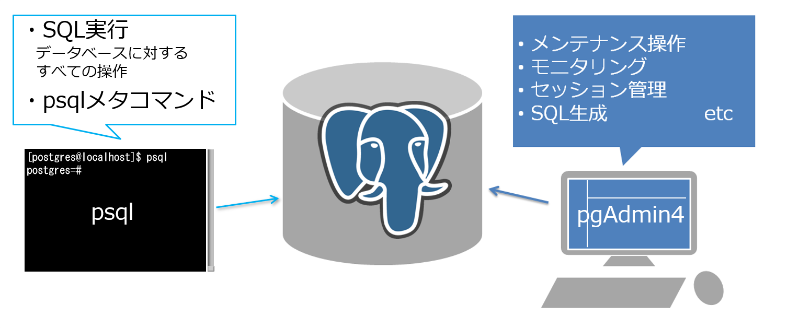
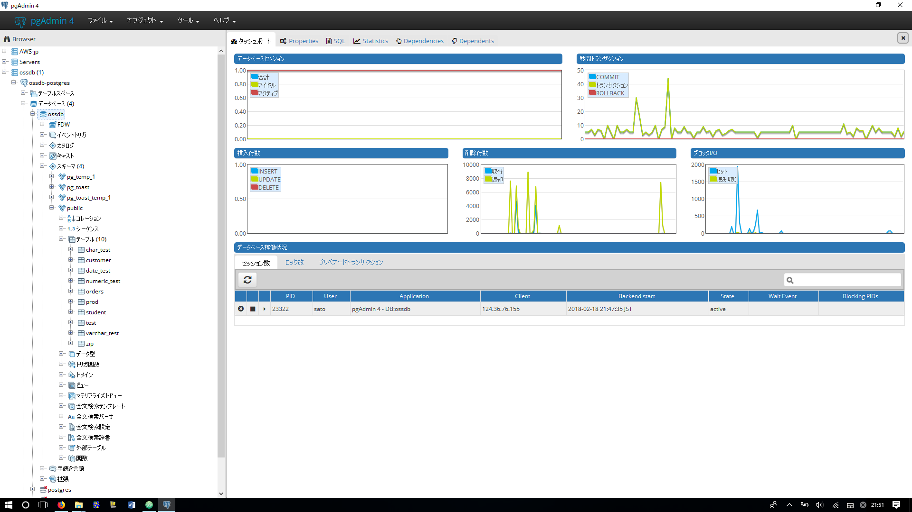
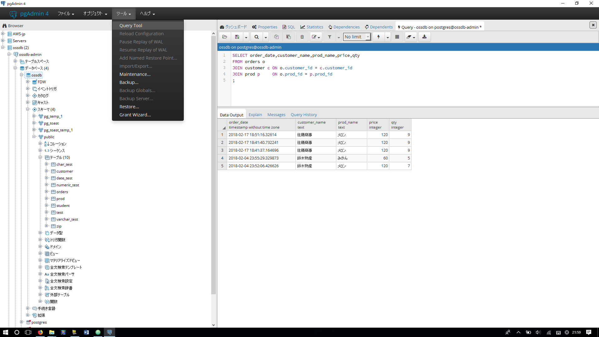

# SQLによるデータベースの操作 基礎編
データベースの操作には SQL を使用します。この章では SQL を利用したデータベースの操作の基礎を学びます。すでに作成されているデータベースに対して SQL を使ってデータの検索や更新などを行ってみましょう。

## データベース利用の基本パターン
データベースの役目は、利用者からの要求に応じて様々なデータを管理することです。それらを分類すると、以下のようなパターンに分けることができます。

* 表を作成する（CREATE TABLE）  
データベースにデータを保管するには、「表（TABLE）」を作成する必要があります。表の項目名や、データの種類（文字や数値など）を指定する必要があります。

* データを挿入する（INSERT）  
データベースにデータを保管することを「挿入(INSERT)」と呼びます。データの種類に合わせたデータを挿入する必要があります。

* データを検索する（SELECT）  
データベースからデータを取り出すことを「検索(SELECT)」と呼びます。条件を指定して一部を取り出したり、複数の表から組み合わせでデータを取り出すなど、様々な検索が行えるのがデータベースのメリットです。

* データを更新する（UPDATE）  
データベースのデータを修正することを「更新(UPDATE)」と呼びます。すべてのデータを一括で修正したり、条件を指定して一部のデータだけを修正したりできます。

* データを削除する（DELETE）  
データベースからデータを取り除くことを「削除(DELETE)」と呼びます。条件を指定して、取り除きたいデータを絞り込みます。

## psqlツールの利用
PostgreSQLに対してSQLを実行してデータベースを操作するには、psqlツール（以下psql）を利用します。

注意： ここからの作業は第11章で説明しているセットアップが行われていることを前提としています。うまく作業が行えない場合には、セットアップが正しく行われていることを確認してください。

### psqlでデータベースに接続する
psqlはLinux上で実行できるコマンドとして提供されているので、利用するにはLinuxにログインする必要があります。

#### ユーザーpostgresで作業可能にする
psqlを実行するには、シェルで作業しているユーザーをユーザーpostgresに切り替えます。

ユーザーpostgresは、LinuxにPostgreSQLをパッケージでインストールした時に自動的に作成されているユーザーです。管理者ユーザーrootでログインした後、suコマンドでユーザーpostgresに切り替えます。

suコマンドでユーザーを切り替えるには、以下のようにsuコマンドに-（ハイフン）をつけて実行するようにしてください。
<!--
``` {#mycode .haskell .numberLines startFrom="100"}
-->
``` {.haskell style="font:osaka;"}
[root@localhost ~]# su - postgres
[postgres@localhost ~]$
```

環境によっては、rootユーザーでログインすることができず、代わりにsudo権限を有する管理者ユーザーが提供されている場合があります。

以下の例ではsudo権限を持つユーザーcentosでログインし、postgresユーザーに変更する例です。
``` {.haskell}
[centos@localhost ~]$ sudo su - postgres
[postgres@localhost ~]$
```
本書ではOSの管理者ユーザーrootで操作可能なものとして例示しますが、自身の環境に応じて適宜読み替えるようにしてください。


#### データベース一覧を表示する
psqlに-lオプションをつけて実行します。psqlはPostgreSQLに接続し、現在作成されているデータベースの一覧を表示します。
``` {.haskell}
[postgres@localhost ~]$ psql -l
                             List of databases
   Name    |  Owner   | Encoding | Collate | Ctype |   Access privileges
-----------+----------+----------+---------+-------+-----------------------
 ossdb     | postgres | UTF8     | C       | C     |
 postgres  | postgres | UTF8     | C       | C     |
 template0 | postgres | UTF8     | C       | C     | =c/postgres          +
           |          |          |         |       | postgres=CTc/postgres
 template1 | postgres | UTF8     | C       | C     | =c/postgres          +
           |          |          |         |       | postgres=CTc/postgres
(4 rows)
```

#### データベースに接続する
psqlを利用してデータベースに接続します。PostgreSQLは同時に複数のデータベースを管理できますが、psqlではそのうちの1つを選んで接続して操作します。

以下のように、psqlの引数として接続したいデータベースの名前を指定して実行します。
``` {.haskell}
[postgres@localhost ~]$ psql ossdb
psql (10.1)
Type "help" for help.

ossdb=#
```

接続に成功すると、プロンプトが表示されてSQL文などの実行命令を受け付ける状態になります。接続できない場合には、PostgreSQLが正しく実行されているか、ユーザーpostgresでpsqlを実行しているかを確認してください。

### psqlのヘルプを表示する
psqlのヘルプを表示します。helpと入力します。
``` {.haskell}
ossdb=# help
You are using psql, the command-line interface to PostgreSQL.
Type:  \copyright for distribution terms
       \h for help with SQL commands
       \? for help with psql commands
       \g or terminate with semicolon to execute query
       \q to quit
```

### メタコマンド
psqlはSQLを受け付けて、PostgreSQLに対してSQLを実行する他に、\（バックスラッシュ）で始まるメタコマンドを受け付けます。
メタコマンドは、ヘルプを表示したり、データベースに対する操作を行ったり、様々な種類のコマンドが用意されています。

#### psqlメタコマンド \h
利用できるSQLのヘルプが確認できます。
``` {.haskell}
ossdb=# \h
Available help:
  ABORT
  ALTER AGGREGATE
  ALTER COLLATION
  ALTER CONVERSION
  ALTER DATABASE  
（以下略）
```

#### psqlメタコマンド \h SQLコマンド
psqlメタコマンド\hの引数にSQLコマンドを指定すると、そのSQLコマンドのヘルプが確認できます。SQLコマンドの指定は大文字でも小文字でも構いません。

``` {.haskell}
ossdb=# \h DELETE
Command:     DELETE
Description: delete rows of a table
Syntax:
[ WITH [ RECURSIVE ] with_query [, ...] ]
DELETE FROM [ ONLY ] table_name [ * ] [ [ AS ] alias ]
    [ USING using_list ]
    [ WHERE condition | WHERE CURRENT OF cursor_name ]
    [ RETURNING * | output_expression [ [ AS ] output_name ] [, ...] ]
```

#### psqlメタコマンド \?
psqlメタコマンド \?で、利用できるpsqlメタコマンドのヘルプが確認できます。
``` {.haskell}
ossdb=# \?
General
  \copyright             show PostgreSQL usage and distribution terms
  \crosstabview [COLUMNS] execute query and display results in crosstab
  \errverbose            show most recent error message at maximum verbosity
  \g [FILE] or ;         execute query (and send results to file or |pipe)
（以下略）
```

### psqlを終了する
psqlを終了するには、psqlメタコマンドの\qを入力します。
``` {.haskell}
ossdb=# \q
[postgres@localhost ~]$
```

### 表の確認
作成されている表を確認するにはpsqlメタコマンド\dを利用します。
``` {.haskell}
ossdb=# \d
          List of relations
 Schema |   Name   | Type  |  Owner
--------+----------+-------+----------
 public | customer | table | postgres
 public | orders   | table | postgres
 public | prod     | table | postgres
(3 rows)
```

### 表定義の確認
表がどのような項目を持っているのかを確認するにはpsqlメタコマンド\dに確認したい表名を付けて実行します。
``` {.haskell}
ossdb=# \d customer
                 Table "public.customer"
    Column     |  Type   | Collation | Nullable | Default
---------------+---------+-----------+----------+---------
 customer_id   | integer |           |          |
 customer_name | text    |           |          |

ossdb=# \d orders
                           Table "public.orders"
   Column    |            Type             | Collation | Nullable | Default
-------------+-----------------------------+-----------+----------+---------
 order_id    | integer                     |           |          |
 order_date  | timestamp without time zone |           |          |
 customer_id | integer                     |           |          |
 prod_id     | integer                     |           |          |
 qty         | integer                     |           |          |

ossdb=# \d prod
                 Table "public.prod"
  Column   |  Type   | Collation | Nullable | Default
-----------+---------+-----------+----------+---------
 prod_id   | integer |           |          |
 prod_name | text    |           |          |
 price     | numeric |           |          |
```

### 表とテーブル、リレーション
本書ではデータの格納先を「表」と記述していますが、psqlの実行結果には「リレーション」や「テーブル」と表記されています。基本的に表とテーブルは同じものと考えて構いません。
リレーションは、本来的な意味ではデータの集合を指していますが、リレーショナルデータベースではリレーションは表形式で表されますので、リレーションと表もほぼ同義と考えて良いでしょう。
同様に、「行」と「レコード」や「タプル」、「列」と「カラム」も同義語になります。

## pgAdmin4（GUIツール）
psqlに並ぶ標準ツールとしてpgAdmin4も用意されています。pgAdmin4はGUI管理ツールで、WindowsなどのGUI環境ではpsqlよりも簡単に使うことができます。（Linux版のpgAdmin4も提供されています。Linuxの構築時点でGUI利用を前提に作成している場合は有用でしょう。）

* pgAdminプロジェクト
  * [https://www.pgadmin.org/](https://www.pgadmin.org/)

Windows版のPostgreSQLをインストールすると、一緒にpgAdmin4もインストールされますし、上記URLからpgAdmin4を個別にインストールして外部のデータベースサーバーに接続して使用することもできます。




複数の管理対象データベースを登録しておいて、操作対象を切り替えながらデータベースの稼動状態、表や索引の一覧やそれぞれの定義情報、状態を確認できます。  



代表的な機能としては、データベースを選択した状態で上部メニューより「ツール」→「クエリツール」を選択するとSQLを実行したり、よく使うSQLを保存しておくことができます。  



データベース名を右クリックして表示されるメニューから「Backup」したり、バックアップを使った「Restore」で簡単にデータをファイルに出力したり、戻すこともできます。テーブル名を右クリックすると「先頭n件のデータを取得」したり、テーブルのメンテナンスが行えるといった形で、GUIならではの直感的な操作が可能です。ぜひいろいろ試してみてください。

## SQLの実行方法
psqlは、psqlメタコマンドとSQLコマンドの2つを受け付けて実行します。psqlメタコマンドは必ず\から始まるので区別されます。psqlメタコマンド以外は、PostgreSQLデータベースに対するSQLコマンドとして実行されます。
psqlでは、改行やスペースは単にSQLコマンドの整形のために用いるもので、SQL構文としての意味を持ちません。SQLコマンドの実行をサーバーに指示する;（セミコロン）または psqlメタコマンド\gを文の末尾に記述することで、文全体をひとつの命令としてサーバーに送信し、処理が行われます。SQLコマンドの実行は、行末に;（セミコロン）をつけて入力を行うか、psqlメタコマンド\gを実行します。
改行しても複数行に渡って入力を受け付けるので、SQL文の入力が終わったら忘れずに;（セミコロン）か、psqlメタコマンド\gを実行してください。

### 複数行入力のプロンプト表示
psqlで複数行入力をした時に表示されるプロンプトは、通常時と複数行入力中の2行目以降で異なります。

#### psqlのプロンプト

表記 | 動作モード |
--- | --- |
データベース名=# | 通常のプロンプト
データベース名-# | 2行目以降のプロンプト


プロンプトに何を表示するかは、psqlの内部変数PROMPT1、PROMPT2で定義されています。たとえば2行目以降のプロンプトに何も表示したくない場合、psqlメタコマンドの\unsetでPROMPT2の変数値を解除します。
``` {.haskell}
ossdb=# 1st line
ossdb-# 2nd line
ossdb-# 3rd line;
ERROR:  syntax error at or near "1"
行 1: 1st line
      ^
ossdb=# \unset PROMPT2
ossdb=# 1st line
2nd line
3rd line;
ERROR:  syntax error at or near "1"
行 1: 1st line
      ^
```

本書では、複数行に渡るSQLを電子版からのコピー＆ペーストで簡単に実行できるように実行例を掲載しています。実習時には2行目以降のプロンプトが出ているのが正しい表示です。

### テキストファイルからの読み込み実行
psqlはテキストファイルから読み込んだ内容を実行する機能があります。同じ処理を何度も繰り返し実行したい場合には、あらかじめメタコマンドやSQLコマンドをファイルに記述して、psqlに読み込ませて実行できます。

#### ファイルを読み込ませる場合のpsqlの構文
``` {.haskell}
$ psql -f ファイル名 [データベース名] [ユーザー名]
```

以下の例では、メタコマンド\dを記述したファイルtest.sqlをpsqlに読み込ませて実行しています。
``` {.haskell}
[postgres@localhost ~]$ cat test.sql
\d
[postgres@localhost ~]$ psql -f test.sql ossdb
          List of relations
 Schema |   Name   | Type  |  Owner
--------+----------+-------+----------
 public | customer | table | postgres
 public | orders   | table | postgres
 public | prod     | table | postgres
(3 rows)
```

## データの検索（SELECT）
データの検索はデータベース利用の一番の基本です。データベースは様々な種類のデータを表形式で保管しているので、そのデータを必要な形で取り出すのがデータの検索です。データの検索にはSQLのSELECT文を使用します。

#### SELECT文の基本構文
``` {.haskell}
SELECT [DISTINCT] * | SELECT項目リスト
	FROM 表名[,…]
	[WHERE 検索条件式]
	[GROUP BY グループ化式]
	[HAVING 検索条件式]
	[ORDER BY 並べ替え式]
```

### 全件全項目検索
データベースの表データを全件、全項目で取り出すのが全件全項目検索です。*(アスタリスク)を指定することで、対象となる検索表の全項目を検索します。

#### 全件全項目検索のSELECT文
``` {.haskell}
SELECT * FROM 表
```

以下の例では、customer表、prod表、orders表の全件全項目検索を行っています。
``` {.haskell}
ossdb=# SELECT * FROM customer;
 customer_id | customer_name
-------------+---------------
           1 | 佐藤商事
           2 | 鈴木物産
           3 | 高橋商店
(3 rows)

ossdb=# SELECT * FROM prod;
 prod_id | prod_name | price
---------+-----------+-------
       1 | みかん    |    50
       2 | りんご    |    70
       3 | メロン    |   100
(3 rows)

ossdb=# SELECT * FROM orders;
 order_id |         order_date         | customer_id | prod_id | qty
----------+----------------------------+-------------+---------+-----
        1 | 2018-01-22 12:34:51.510398 |           1 |       1 |  10
        2 | 2018-01-22 12:34:58.875188 |           2 |       2 |   5
        3 | 2018-01-22 12:35:07.440391 |           3 |       3 |   8
        4 | 2018-01-22 12:35:16.847541 |           2 |       1 |   3
        5 | 2018-01-22 12:35:26.164922 |           3 |       2 |   4
(5 rows)
```

### SELECT項目リスト
SELECT文で検索したい列名をカンマ区切りで並べて指定します。

#### SELECT項目リストを使ったSELECT文
``` {.haskell}
SELECT 列名[,列名...] FROM 表
```

以下の例では、prod表からprod_name列、price列のみ検索しています。
``` {.haskell}
ossdb=# SELECT prod_name,price FROM prod;
 prod_name | price
-----------+-------
 みかん    |    50
 りんご    |    70
 メロン    |   100
(3 rows)
```

### WHERE句による絞り込み検索
検索で取り出すデータ行を条件で絞り込むには、WHERE句を使用します。

#### WHERE句の構文
``` {.haskell}
WHERE 列名 条件式 条件値
```

#### 主な条件式

条件式	  | 意味
------- | --------
=	      | 等しい
<>      |	等しくない
\>	      | よりも大きい
<	      | よりも小さい（未満）
\>=      | 以上
<=      | 以下
BETWEEN | 範囲指定
LIKE    |	部分一致

それぞれの条件式を使ってどのような結果が得られるか見てみましょう。

#### 等号、不等号
* 等しい(=)、等しくない(<>)  
ある列の値が指定した条件値と等しい、あるいは等しくないデータを取り出します。条件値を文字列として指定する場合には'(シングルクォート)で括ります。
以下の例では、customer表からcustomer_id列の値が2の行データを検索します。
``` {.haskell}
ossdb=# SELECT * FROM customer WHERE customer_id = 2;
 customer_id | customer_name
-------------+---------------
           2 | 鈴木物産
(1 row)
```
以下の例では、customer表からcustomer_id列の値が2以外の行データを検索します。
``` {.haskell}
ossdb=# SELECT * FROM customer WHERE customer_id <> 2;
 customer_id | customer_name
-------------+---------------
           1 | 佐藤商事
           3 | 高橋商店
(2 rows)
```
以下の例では、customer表からcustomer_name列の値が「佐藤商事」の行データを検索します。文字列データを指定する場合、'（シングルクォート）で前後を括ります。
``` {.haskell}
ossdb=# SELECT * FROM customer WHERE customer_name = '佐藤商事';
 customer_id | customer_name
-------------+---------------
           1 | 佐藤商事
(1 row)
```

* よりも大きい(>)、よりも小さい（未満）(<)  
ある列の値が指定した条件値よりも大きい、あるいは小さい（未満）データを取り出します。
以下の例では、prod表からprice列の値が70よりも大きい行データを検索します。price列の値が70のりんごは含まれません。
``` {.haskell}
ossdb=# SELECT * FROM prod WHERE price > 70;
 prod_id | prod_name | price
---------+-----------+-------
       3 | メロン    |   100
(1 row)
```

* 以上(>=)、以下(<=)  
ある列の値が指定した条件値以上、あるいは以下のデータを取り出します。
以下の例では、prod表からprice列の値が70以上の行データを検索します。price列の値が70のりんごも含まれます。
``` {.haskell}
ossdb=# SELECT * FROM prod WHERE price >= 70;
 prod_id | prod_name | price
---------+-----------+-------
       2 | りんご    |    70
       3 | メロン    |   100
(2 rows)
```

#### 範囲検索
* A 以上 B 以下  
条件式に2つの値を指定し、その間の範囲に該当するデータを取り出します。以下の例では、prod表からprice列の値が10以上80以下の行データを検索します。price列が50のみかん、70のりんごが含まれ、範囲外であるメロンは含まれません。
``` {.haskell}
ossdb=# SELECT * FROM prod WHERE price BETWEEN 10 AND 80;
 prod_id | prod_name | price
---------+-----------+-------
       1 | みかん    |    50
       2 | りんご    |    70
(2 rows)
```
この結果は、不等号を使った「以上、以下」を組み合わせた場合と同じです。
``` {.haskell}
ossdb=# SELECT * FROM prod WHERE price >= 10 AND price <= 80;
 prod_id | prod_name | price
---------+-----------+-------
       1 | みかん    |    50
       2 | りんご    |    70
(2 rows)
```

#### 部分一致検索
部分一致検索にはLIKE演算子を用います。文字列の一部に指定した文字列を含むデータを取り出します。

* 指定した値がデータのどこかに一致（中間一致検索）  
文字列中に「ん」を含むものを検索します。検索したい文字を%で囲みました。文字列なので’(シングルクォート)で囲む点はこれまでの検索と同じです。
以下の例では、文字列中に「ん」を含む「みかん」「りんご」が該当します。（「メロン」は「ン」を含みますが、コンピューターは「ん」と「ン」を通常は区別します。）
``` {.haskell}
ossdb=# SELECT * FROM prod WHERE prod_name LIKE '%ん%';
 prod_id | prod_name | price
---------+-----------+-------
       1 | みかん    |    50
       2 | りんご    |    70
(2 rows)
```

* 前方一致検索、後方一致検索  
文字列の最後に「ん」を含むものを検索します。先ほど同様%と組み合わせますが、文字列の最後であることを表すために、「ん」の後の%は指定しません。このような検索を後方一致検索と呼びます。
以下の例では、文字列の最後に「ん」を含む「みかん」が該当します。
``` {.haskell}
ossdb=# SELECT * FROM prod WHERE prod_name LIKE '%ん';
 prod_id | prod_name | price
---------+-----------+-------
       1 | みかん    |    50
(1 row)
```
前方一致検索の場合は、検索したい文字列を先頭にします。（例：’り%’ とすると「りんご」が該当）

* 該当する文字位置を指定する場合  
指定した値が文字列中の何文字目にあるか指定する検索です。先ほどの%は複数文字を表しましたが、その代わりに1文字につきひとつの_（アンダースコア）を使います。
以下の例では、3文字目が「ん」であるものを検索するためにアンダースコアを2つ並べて「\__ん」を条件にしており、結果として「みかん」が検索されています。アンダースコア1文字分では結果は得られません。
``` {.haskell}
ossdb=# SELECT * FROM prod WHERE prod_name LIKE '__ん';
 prod_id | prod_name | price
---------+-----------+-------
       1 | みかん    |    50
(1 row)
ossdb=# SELECT * FROM prod WHERE prod_name LIKE '_ん';
 prod_id | prod_name | price
---------+-----------+-------
(0 rows)
```

* 指定した文字列を「含まない」検索  
一致=に対して、不一致を表す<>があったように、LIKEに対してその文字列を含まないことを表すNOT LIKEが用意されています。
以下の例では、NOT LIKEを使って「ん」を含まないものを検索します。「メロン」のみ該当します。
``` {.haskell}
ossdb=# SELECT * FROM prod WHERE prod_name NOT LIKE '%ん%';
 prod_id | prod_name | price
---------+-----------+-------
       3 | メロン    |   100
(1 row)
```
同様に「前方（後方）不一致検索」も可能です。
``` {.haskell}
ossdb=# SELECT * FROM prod WHERE prod_name NOT LIKE '%ん';
 prod_id | prod_name | price
---------+-----------+-------
       2 | りんご    |    70
       3 | メロン    |   100
(2 rows)
```

## ORDER BY句による並べ替え
検索結果を指定した順番に並べ替えるには、ORDER BY句を使用します。リレーショナルデータベースではデータを集合として扱うため、並び順を指定しない限り結果の表示順を保証しません。ORDER BY句で並べ替えを指定することで、期待した順番で行データを取り出すことができます。DESCを指定すると、降順で並べ替えが行われます。

#### ORDER BY句の構文
``` {.haskell}
ORDER BY 列名 [DESC]
```
以下の例では、prod表からprice列の値で昇順、降順で並べ替えをしています。
``` {.haskell}
ossdb=# SELECT * FROM prod ORDER BY price;
 prod_id | prod_name | price
---------+-----------+-------
       1 | みかん    |    50
       2 | りんご    |    70
       3 | メロン    |   100
(3 rows)

ossdb=# SELECT * FROM prod ORDER BY price DESC;
 prod_id | prod_name | price
---------+-----------+-------
       3 | メロン    |   100
       2 | りんご    |    70
       1 | みかん    |    50
(3 rows)
```

## 表の結合
リレーショナルデータベースでは、表と表を結びつけてデータを取り出すことができます。表を結びつけることを「結合」と呼びます。

### JOIN句による結合
結合を行うにはJOIN句で結合したい列を指定します。指定された列の値を比較し、同じ値のデータを結合します。

#### JOIN 〜 ON 構文
``` {.haskell}
FROM 表1
	JOIN 表2 ON 表1.列 = 表2.列
```
単一の表に対するSELECTでは、対象の表をFROM句で指定してきましたが、結合では二つ目の表を指定するためにJOIN句のあとに表名を続けます。このとき表の指定とセットで使うON句も重要です。ON句の後には結合条件を記述します。二つの表同士で関連する列を結合条件に指定し、この値が一致するデータが結果として取得されます。

結合の使い方を順を追ってみていきましょう。

* 単一の表を検索  
以下の例では、結合を行う元となる表であるorders表のorder_id列、customer_id列、prod_id列、qty列をSELECT項目リストに指定したSELECT文です。
``` {.haskell}
ossdb=# SELECT order_id,customer_id,prod_id,qty FROM orders;
 order_id | customer_id | prod_id | qty
----------+-------------+---------+-----
        1 |           1 |       1 |  10
        2 |           2 |       2 |   5
        3 |           3 |       3 |   8
        4 |           2 |       1 |   3
        5 |           3 |       2 |   4
(5 rows)
--                  ↑         ↑
-- 「customer表」「prod表」から合致する値を取得する
```
この検索結果のうち、customer_id列とprod_id列はそれぞれcustomer表、prod表から別の値を持ってきて置き換えることにします。

* orders表とcustomer表を結合  
FROM句またはJOIN句で複数の表を指定した場合には、SELECT項目リストや結合条件では「表名.列名」と指定します。
まずはorders表とcustomer表の2つの表をJOIN句で結合します。ここでは先の結果と比較するため、order_id列、customer_id列と並べて、新たにcustomer表から得られたcustomer_name列の値を表示します。
``` {.haskell}
ossdb=# SELECT orders.order_id,orders.customer_id,customer.customer_name
FROM orders
JOIN customer ON orders.customer_id = customer.customer_id;
 order_id | customer_id | customer_name
----------+-------------+---------------
        1 |           1 | 佐藤商事
        2 |           2 | 鈴木物産
        3 |           3 | 高橋商店
        4 |           2 | 鈴木物産
        5 |           3 | 高橋商店
(5 rows)
```
customer表には以下のデータが格納されていましたので、customer_idが「1」のときは「佐藤商事」、「2」のときは「鈴木物産」というように、行ごとに関連する値がcustomer表から検索されていることがわかります。

customer_id | customer_name
------------ | --------------
          1 | 佐藤商事
          2 | 鈴木物産
          3 | 高橋商店


* orders表とprod表を結合  
同様に、orders表とprod表をJOIN句で結合します。
``` {.haskell}
ossdb=# SELECT orders.order_id,prod.prod_name
FROM orders
JOIN prod ON orders.prod_id = prod.prod_id;
 order_id | prod_name
----------+-----------
        1 | みかん
        2 | りんご
        3 | メロン
        4 | みかん
        5 | りんご
(5 rows)
```

* 3つの表を結合  
この2つのJOIN句を1つのSELECT文にまとめます。最初に実行したSELECT文は以下の通りでした。
``` {.haskell}
SELECT order_id,customer_id,prod_id,qty
FROM orders
```
最初のSELECT文と比較して、SELECT項目リストの置き換わりと、JOIN句が2つ並べて追加されている点に注目してください。  
``` {.haskell}
ossdb=# SELECT orders.order_id,customer.customer_name,prod.prod_name,orders.qty
FROM orders
JOIN customer ON orders.customer_id = customer.customer_id
JOIN prod     ON orders.prod_id = prod.prod_id;
 order_id | customer_name | prod_name | qty
----------+---------------+-----------+-----
        1 | 佐藤商事      | みかん    |  10
        2 | 鈴木物産      | りんご    |   5
        3 | 高橋商店      | メロン    |   8
        4 | 鈴木物産      | みかん    |   3
        5 | 高橋商店      | りんご    |   4
(5 rows)
```
customer_idをcustomer表から取得した店名、prod_idをprod表から取得した商品名に置き換えることができました。


### 表別名の利用
SQL文の中で何度も使用する表名は、FROM句、またはJOIN句で別名を指定できます。短い別名を指定すれば、SQL文を短くして見やすくすることができます。

#### 表別名の指定方法
``` {.haskell}
FROM 表名 別名
JOIN 表名 別名
```
前のJOIN句による結合を行うSQL文に表別名を適用すると、以下のようになります。
``` {.haskell}
ossdb=# SELECT o.order_id,c.customer_name,p.prod_name,o.qty
FROM orders o
JOIN customer c ON o.customer_id = c.customer_id
JOIN prod p     ON o.prod_id = p.prod_id;
 order_id | customer_name | prod_name | qty
----------+---------------+-----------+-----
        1 | 佐藤商事      | みかん    |  10
        2 | 鈴木物産      | りんご    |   5
        3 | 高橋商店      | メロン    |   8
        4 | 鈴木物産      | みかん    |   3
        5 | 高橋商店      | りんご    |   4
(5 rows)
```

## 行データの入力（INSERT）
表に行データを入力するには、INSERT文を使用します。

#### INSERT文の構文
``` {.haskell}
INSERT INTO 表名(列名[,…])
	VALUES (値[,...])
```

値に文字列データを指定する場合には、'（シングルクォート）で括る必要があります。
``` {.haskell}
ossdb=# INSERT INTO prod(prod_id,prod_name,price) VALUES (4,'バナナ',30);
INSERT 0 1
ossdb=# SELECT * FROM prod;
 prod_id | prod_name | price
---------+-----------+-------
       1 | みかん    |    50
       2 | りんご    |    70
       3 | メロン    |   100
       4 | バナナ    |    30
(4 rows)
```

## データの更新（UPDATE）
行データを更新するには、UPDATE文を使用します。

#### UPDATE文の構文
``` {.haskell}
UPDATE 表名
	SET 列名 = 値
	WHERE 条件式
```

以下の例では、prod表のprod_id列の値が4の行データを、price列の値を40に更新しています。
``` {.haskell}
ossdb=# UPDATE prod SET price = 40 WHERE prod_id = 4;
UPDATE 1
ossdb=# SELECT * FROM prod;
 prod_id | prod_name | price
---------+-----------+-------
       1 | みかん    |    50
       2 | りんご    |    70
       3 | メロン    |   100
       4 | バナナ    |    40
(4 rows)
```

更新値は、既存の行データの値に対する演算で設定することもできます。以下の例では、prod表のprice列の値を一律10増加させています（その後、元に戻しています）。
``` {.haskell}
ossdb=# UPDATE prod SET price = price + 10;
UPDATE 4
ossdb=# SELECT * FROM prod;
 prod_id | prod_name | price
---------+-----------+-------
       1 | みかん    |    60
       2 | りんご    |    80
       3 | メロン    |   110
       4 | バナナ    |    50
(4 rows)

ossdb=# UPDATE prod SET price = price - 10;
UPDATE 4
```

## 行データの削除（DELETE）
行データを削除するには、DELETE文を使用します。DELETE文はWHERE句で指定した条件式に適合した行データをすべて削除します。WHERE句を指定しなかった場合には、指定された表の行データはすべて削除されます。

#### DELETE文の構文
``` {.haskell}
DELETE FROM 表名
	WHERE 条件式
```

以下の例では、prod表からprod_id列の値が4の行データを削除しています。
``` {.haskell}
ossdb=# DELETE FROM prod WHERE prod_id = 4;
DELETE 1
ossdb=# SELECT * FROM prod;
 prod_id | prod_name | price
---------+-----------+-------
       1 | みかん    |    50
       2 | りんご    |    70
       3 | メロン    |   100
(3 rows)
```

\pagebreak

