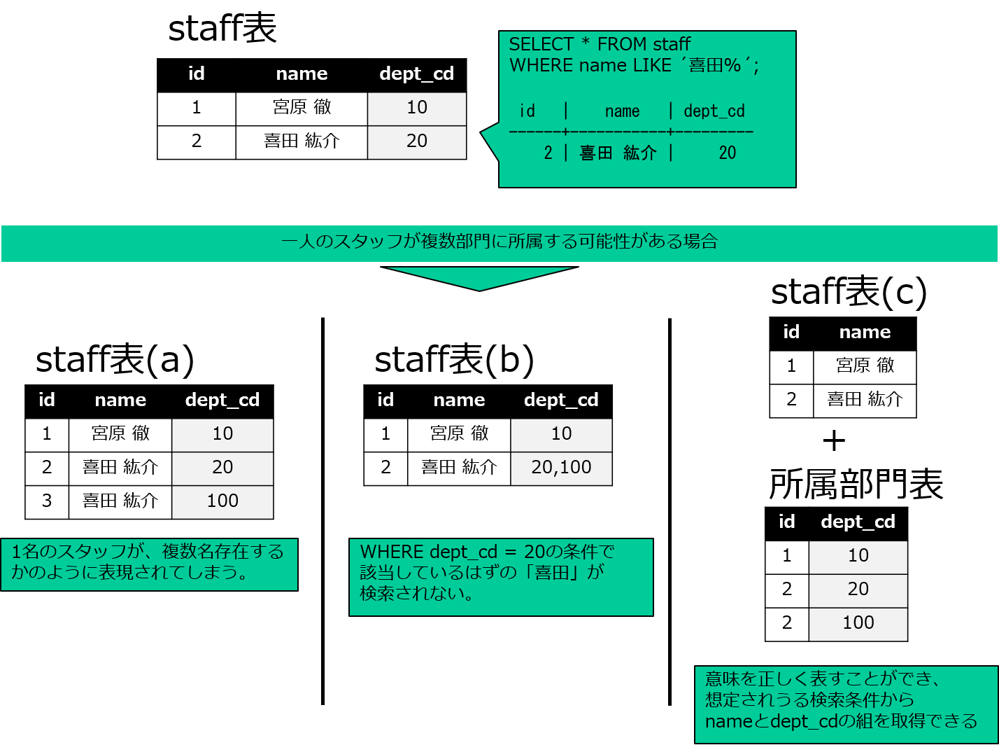

# 表
第4章では、リレーショナルデータベースの基本的なデータ格納の仕組みである表について解説します。

## 表の作成（CREATE TABLE）
前の章では例文中で簡単な表を作成し、その表に対してSQL文を実行していました。実際のデータベースでは利用者が目的に応じて表を作成します。表の作成方法を見ていましょう。

表の作成は、CREATE TABLE文を使用します。

CREATE TABLE文の構文は以下の通りです。

```
CREATE TABLE 表名
	(列名 データ型 [NULL|NOT NULL]
		| [UNIQUE]
		| [PRIMARY KEY (列名[,...])]
		| [REFERNCES 外部参照表名 (参照列名)]
	[,...])
```

表を作成するには、列の名前と、その列にどのようなデータが入るのかを決めなければいけません。ここでは、以下のような3つの列を持つstaff表を作成します。

| | 列名 | データ型
|----|--------|----------
| 社員番号 | id | integer型
| 氏名 | name | text型
| 誕生日 | birthday | date型

これをSQL文にすると、以下のようになります。作成ができたら、表の一覧に入っていることと、表の定義を確認しておきましょう。

```
ossdb=# CREATE TABLE staff
                    (id       integer,
                     name     text,
                     birthday date);
CREATE TABLE

ossdb=# \d
               リレーション一覧
 スキーマ |     名前     |  タイプ  |  所有者
----------+--------------+----------+----------
 public   | char_test    | テーブル | postgres
 public   | customer     | テーブル | postgres
 public   | date_test    | テーブル | postgres
 public   | numeric_test | テーブル | postgres
 public   | orders       | テーブル | postgres
 public   | prod         | テーブル | postgres
 public   | staff        | テーブル | postgres
 public   | varchar_test | テーブル | postgres
(8 行)

ossdb=# \d staff
                   テーブル"public.staff"
    列    | タイプ  | 照合順序 | Null 値を許容 | デフォルト
----------+---------+----------+---------------+------------
 id       | integer |          |               |
 name     | text    |          |               |
 birthday | date    |          |               |
```

## staff表にデータを格納する
INSERT文を使ってstaff表にデータを格納してみましょう。

```
ossdb=# INSERT INTO staff (id,name,birthday) VALUES (1,'宮原徹','1972-01-09');
INSERT 0 1
ossdb=# SELECT * FROM staff;
 id |  name  |  birthday
----+--------+------------
  1 | 宮原徹 | 1972-01-09
(1 行)
```

## 表定義の修正（ALTER TABLE）
表を作成した後で表定義を修正するにはALTER TABLE文を使用します。

ALTER TABLE文では表そのものの定義や動作の修正に加え、表内の列定義の修正も可能で、その分指定の方法が複雑になっています。

メタコマンド\\hで構文のヘルプを確認してみましょう。ここでは詳細を覚える必要はありませんが、変更対象の表を指定し、さらに「新しい列を追加する（=ADD COLUMN）」のようなactionを指定することをヘルプから読み取ってみてください。
```
ossdb=# \h ALTER TABLE
コマンド:    ALTER TABLE
説明: テーブルの定義を変更します。
書式:
ALTER TABLE [ IF EXISTS ] [ ONLY ] 名前 [ * ]
    アクション [, ... ]

（略）

アクションは以下のいずれかです:

    ADD [ COLUMN ] [ IF NOT EXISTS ] 列名 データ型 [ COLLATE 照合順序 ] [ カラム制約 [ ... ] ]
    DROP [ COLUMN ] [ IF EXISTS ] 列名 [ RESTRICT | CASCADE ]
    ALTER [ COLUMN ] 列名 [ SET DATA ] TYPE データ型 [ COLLATE 照合順序 ] [ USING 評価式 
（略）
```

ここでは新たに列を追加するALTER TABLE文を試してみましょう。staff表に所属部署を表すdept_id列を追加し、その列にUPDATE文で値を格納しています。
```
ossdb=# ALTER TABLE staff ADD COLUMN dept_id integer;
ALTER TABLE
ossdb=# \d staff
                   テーブル"public.staff"
    列    | タイプ  | 照合順序 | Null 値を許容 | デフォルト
----------+---------+----------+---------------+------------
 id       | integer |          |               |
 name     | text    |          |               |
 birthday | date    |          |               |
 dept_id  | integer |          |               |

 ossdb=# UPDATE staff SET dept_id = 1 WHERE id = 1;
 UPDATE 1
 ossdb=# SELECT * FROM staff;
 id |  name  |  birthday  | dept_id
----+--------+------------+---------
  1 | 宮原徹 | 1972-01-09 |       1
(1 行)
```

## 表定義の修正は原則として行わない
ALTER TABLE文で修正できる内容は様々ですが、すでにデータが格納されている状態で安易に列の定義を修正することは望ましくありません。少なくとも以下のような設計の面や、作業による影響を考慮して実施方法を検討しましょう。

### 正しい設計になっているか  
例えば、上記ではstaff表にdept_id列を追加しましたが、所属部門をstaff表で管理することは理想的な対応だったでしょうか。SELECT * FROM staff;とすれば所属情報込みでスタッフを一覧表示できることは確かに便利かもしれません。しかし、1名のスタッフが複数部門に所属するケースは起こりえないでしょうか。

このような場合は、新たに所属部門表を作成し「01番のスタッフはAという組織に所属する」という事実を表すようにします。「01番のスタッフは同時にCという組織に所属する」場合は、もう一行追加すればよいのです。

所属部門表の例は以下の通りです。意味の列は実際のデータベースの表には含めません。

| スタッフID | 部門コード | 意味
| --- | --- | ---
| 01 | A | スタッフ01はAという組織に所属
| 02 | B | スタッフ02はBという組織に所属
| 03 | C | スタッフ03はCという組織に所属
| 01 | C | スタッフ01はCという組織に所属（同時にAとCに所属していることがわかる）



\pagebreak

### 表定義の変更作業そのものが及ぼす影響
仮に、スタッフ一覧に部門コードを持つことが適切であったとして、変更作業そのものがシステム全体に悪影響を及ぼす可能性があります。

小規模な表であれば短時間で終わるため問題は少ないですが、たとえば数百万人のデータを収めたウェブサービスの会員表ならばどうでしょうか。利用者がログインするたびにこの表が参照されているような場合、表の変更作業中は参照できなくなるため、誰もログインできなくなります。実際のデータベース製品の実装では、表定義の変更中の参照が許されているものもあります。しかし、データの更新などは行えなくなるので、なんらかの影響は出てしまいます。

影響する範囲や時間を鑑みて、表の定義を変更するのではなく上記のような表を新規に作成することで、利用者の操作を妨げることなく必要なデータを保持することができます。

### 短期の対策と中長期の対策
さしあたって必要なデータを格納するために、新規に所属部門表を作成したとします。しかし、やはり設計上はスタッフ一覧に部門コードを持つことが最適という場合もあるでしょう。

大規模メンテナンスによるサービス休止期間を利用者にアナウンスし、理想的な表に変更することは中長期的な対策としては有用です。

ある操作が他のSQLやプログラムにどのような影響を与えるかは、いかなる操作であっても考慮が必要です。その中でも特に表のメンテナンスは影響範囲が大きくなりやすいですので十分に注意しましょう。

## 表の削除
表を削除するには、DROP TABLE文を使用します。
表を削除すると、表に格納されているデータも一緒に削除されて元に戻すことができません。

```
ossdb=# \d
               リレーション一覧
 スキーマ |     名前     |  タイプ  |  所有者
----------+--------------+----------+----------
 public   | char_test    | テーブル | postgres
 public   | customer     | テーブル | postgres
 public   | date_test    | テーブル | postgres
 public   | numeric_test | テーブル | postgres
 public   | orders       | テーブル | postgres
 public   | prod         | テーブル | postgres
 public   | staff        | テーブル | postgres
 public   | varchar_test | テーブル | postgres
(8 行)

ossdb=# DROP TABLE staff;
DROP TABLE
ossdb=# \d
               リレーション一覧
 スキーマ |     名前     |  タイプ  |  所有者
----------+--------------+----------+----------
 public   | char_test    | テーブル | postgres
 public   | customer     | テーブル | postgres
 public   | date_test    | テーブル | postgres
 public   | numeric_test | テーブル | postgres
 public   | orders       | テーブル | postgres
 public   | prod         | テーブル | postgres
 public   | varchar_test | テーブル | postgres
(7 行)
```

## TRUNCATEによるデータ削除
データを削除する操作には、表を定義ごと削除するDROP TABLEの他に、WHERE条件に該当した行だけを削除するDELETE、表のデータのみ全件削除するTRUNCATEがあります。

条件に該当する特定の行のデータだけを削除したい場合にはDELETE文を使用しますが、DELETE文でのデータ削除は対象となるデータの件数が多いと時間がかかります。例えば時系列に沿って蓄積されるデータのうち、保管期限を過ぎたものを一括削除するようなケースでは、表を月別などに分割しておき、月単位でTRUNCATEすることも考えます。

DROP TABLE文は表と表データだけでなく、関連する索引やビューなど、その他のものも併せて削除してしまいます。表を再作成する場合、これらも再定義する必要があるため時間がかかるという問題が発生します。このような問題が起きないよう、行データだけを一括で削除する場合にはTRUNCATE文を使用します。

TRUNCATE文の構文は以下の通りです。

```
TRUNCATE 表名
```

以下の例では、char_test表のすべての行データをすべてTRUNCATE文で削除しています。

```
ossdb=# SELECT * FROM char_test;
 string
--------
 あ
 ABC
 あいう
(3 行)

ossdb=# TRUNCATE char_test;
TRUNCATE TABLE
ossdb=# SELECT * FROM char_test;
 string
--------
(0 行)
```

## データのセーブ・ロード
psqlを使って、データをファイルにセーブしたり、ファイルからロードすることができます。

方法には、SQLであるCOPY文を使う方法と、psqlメタコマンドである\\copyを使う方法があります。両者は似ていますが、仕組みが若干違います。それぞれについて解説します。

### COPY文はSQLとして実行される
COPY文はSQLとして実行され、PostgreSQLが動作しているOSのファイルに直接データを書き出します。そのため、以下の制限があります。

- PostgreSQLのスーパーユーザーでのみ実行することができます。この実習ではpostgresユーザーがスーパーユーザーにあたります。
- リモートに書き出すことはできません。データはPostgreSQLが動作しているサーバーのローカルファイルとして書き出されます。リモートにデータが欲しい場合には、書き出されたファイルをリモートにネットワーク経由で転送する必要があります。

### COPY TO文による行データのセーブ
COPY TO文でデータをファイルにセーブできます。

COPY TO文によるデータのセーブの構文は以下の通りです。FORMAT句でcsvを指定することで、CSV形式のファイルとしてセーブができます。

```
COPY 表名 TO ファイル (FORMAT 形式)
```

以下の例は、customer表のデータをCSV形式でファイルにセーブしています。
\\!メタコマンドはLinuxのシェルコマンドを実行しています。

```
ossdb=# COPY customer TO '/tmp/customer.csv' (FORMAT csv);
COPY 3
ossdb=# \! cat /tmp/customer.csv
1,佐藤商事
2,鈴木物産
3,高橋商店
```

COPY TO文は、ファイルの保存先によってはOSのセキュリティを制御しているSELinuxによって拒否される場合があります。確認方法については後述します。

### CSVファイルのロード
COPY FROM文でファイルから行データをロードできます。

COPY文によるデータのロードの構文は以下の通りです。FORMAT句でcsvを指定することで、CSV形式のファイルからロードできます。

```
COPY 表名 FROM ファイル (FORMAT 形式)
```

以下の例は、customer表のデータをCSV形式のファイルからロードしています。
```
ossdb=# DELETE FROM customer;
DELETE 3
ossdb=# SELECT * FROM customer;
 customer_id | customer_name
-------------+---------------
(0 行)

ossdb=# COPY customer FROM '/tmp/customer.csv' (FORMAT csv);
COPY 3
ossdb=# SELECT * FROM customer;
 customer_id | customer_name
-------------+---------------
           1 | 佐藤商事
           2 | 鈴木物産
           3 | 高橋商店
(3 行)
```

### \\copyメタコマンドはpsqlで処理される
psqlはCOPY文と同様の動作をする\\copyメタコマンドが使用できます。異なるのは以下の点です。

- COPY文はSQLであり、DBサーバーが実行する。出力ファイルはDBサーバー内に作成される。それに対して、\\copyメタコマンドはクライアントからのデータ取得操作であり、出力ファイルはクライアント端末内に作成される。
- ファイル指定が絶対指定のほか、psql実行時のクライアント端末のカレントディレクトリからの相対指定でも可能

具体的な使用例はこの後の演習で解説します。

### 参考：PostgreSQLとSELinuxの関係
COPY文はPostgreSQLがOS上にファイルを作成してデータをセーブします。このファイル作成が、OS側のセキュリティを制御しているSELinuxによって拒否される場合があります。

以下は、postgresユーザーのホームディレクトリにCSVファイルを作成しようとする例です。SELinuxによりホームディレクトリへのファイル作成が拒否されて、エラーが発生しています。

```
ossdb=# COPY customer TO '/home/postgres/customer.csv' (FORMAT csv);
ERROR:  ファイル"/home/postgres/customer.csv"を書き込み用にオープンできませんでした: 許可がありません
HINT:  COPY TOによってPostgreSQLサーバプロセスはファイルの書き込みを行います。psqlの \copy のようなクライアント側の仕組みが必要かもしれません
```

SELinuxのログは/var/log/audit/audit.logに記録されています。このログファイルから、customer.csvの文字列を探してみると、どのような処理が拒否されたのかが分かります。

postgresql_tコンテキストによる、user_home_dir_tコンテキストに対しての、add_nameなどのOSのファイル操作に関わる処理が拒否されています。

```
[admin@host1 ~]$ sudo grep customer.csv /var/log/audit/audit.log
type=AVC msg=audit(1712711439.220:626): avc:  denied  { add_name } for  pid=24821 comm="postmaster" name="customer.csv" scontext=system_u:system_r:postgresql_t:s0 tcontext=unconfined_u:object_r:user_home_dir_t:s0 tclass=dir permissive=1
type=AVC msg=audit(1712711439.220:626): avc:  denied  { create } for  pid=24821 comm="postmaster" name="customer.csv" scontext=system_u:system_r:postgresql_t:s0 tcontext=system_u:object_r:user_home_dir_t:s0 tclass=file permissive=1
type=AVC msg=audit(1712711439.220:626): avc:  denied  { write open } for  pid=24821 comm="postmaster" path="/home/postgres/customer.csv" dev="dm-0" ino=18700809 scontext=system_u:system_r:postgresql_t:s0 tcontext=system_u:object_r:user_home_dir_t:s0 tclass=file permissive=1
type=AVC msg=audit(1712711439.220:627): avc:  denied  { getattr } for  pid=24821 comm="postmaster" path="/home/postgres/customer.csv" dev="dm-0" ino=18700809 scontext=system_u:system_r:postgresql_t:s0 tcontext=system_u:object_r:user_home_dir_t:s0 tclass=file permissive=1
```

行いたい処理がSELinuxによって拒否される場合には、/tmpディレクトリのように拒否されない場所にファイルを作成する処理に変更するか、SELinuxの設定を適切に変更してください。

SELinuxが原因かどうかを確認するために、一時的にSELinuxをPermissiveで動作させることもできます。ただし、Permissiveへの変更は確認作業を行う目的のみとし、問題に対する対処が終わったらEnforcingに戻す必要があります。

以下の例では、SELinuxがEnforcingの状態からPermissiveに変更しています。

```
[root@host1 ~]# getenforce
Enforcing
[root@host1 ~]# setenforce 0
[root@host1 ~]# getenforce
Permissive
```

再度、COPY文を実行すると、今度は成功します。

```
ossdb=# COPY customer TO '/home/postgres/customer.csv' (FORMAT csv);
COPY 3
```

原因がSELinuxと分かったら、Enforicingに戻し、適切な対処を行ってください。


\pagebreak
