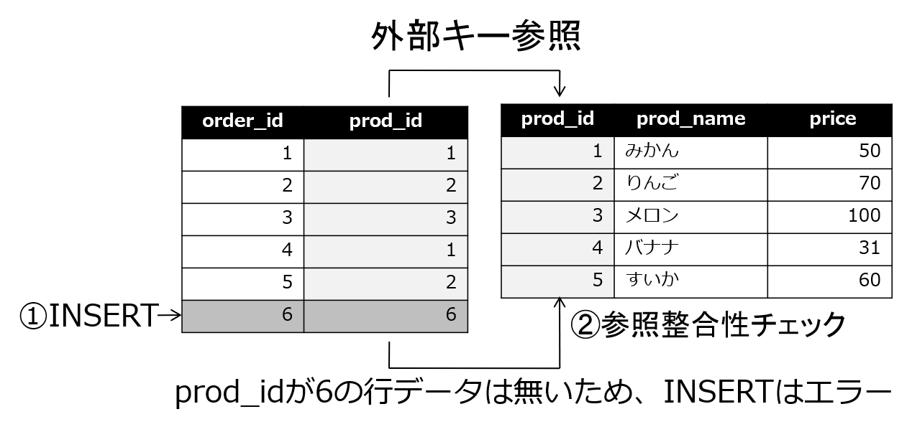

# データベース定義の応用
データベースのデータの整合性を高め、より効率的に使うためにはデータベースの定義をしっかりと行う必要があります。この章では主キー、外部キーなどのデータベースの定義に必要となる基礎知識や、シーケンスなどの便利な機能について解説します。

## 主キー
主キーは、表のデータを一意に識別できる1つ以上の列のことです。
「一意」(UNIQUE)とは、列の値が重複していないことです。一意である列のことを「一意キー」とも呼びます。
主キーは一意キーである他に、必ず値が入っている必要があります。必ず値が入っていることを「NULLではない」(NOT NULL)と呼びます。NULLについての詳細は後述します。

以下の例では、orders表のorder_id列を条件にすれば特定の一行だけを取り出すことができますが、customer_id列を条件にすると複数の行データが取り出されてしまいます。この場合、order_id列は一意の値を持つので主キーとして使用できますが、customer_id列は一意の値を持つことはできないと考えられますので、主キーにはなりません。
``` {.haskell}
ossdb=# SELECT * FROM orders WHERE order_id = 1;
 order_id |         order_date         | customer_id | prod_id | qty
----------+----------------------------+-------------+---------+-----
        1 | 2018-01-22 12:34:51.510398 |           1 |       1 |  10
(1 row)

ossdb=# SELECT * FROM orders WHERE customer_id = 2;
 order_id |         order_date         | customer_id | prod_id | qty
----------+----------------------------+-------------+---------+-----
        2 | 2018-01-22 12:34:58.875188 |           2 |       2 |   5
        4 | 2018-01-22 12:35:16.847541 |           2 |       1 |   3
(2 rows)
```

### 主キーを指定する
主キーを指定するには、CREATE TABLE文で表の作成時に指定するか、すでに作成されている表に対してALTER TABLE文で指定します。

#### 主キーを指定するALTER TABLE文の構文
``` {.haskell}
ALTER TABLE 表名 ADD PRIMARY KEY　(列名[,...])
```

以下の例では、prod表のprod_id列を主キーに指定しています。主キーを指定すると、検索を高速化するためのインデックスが自動的に（暗黙的に）作成されます。
主キーに指定された列には、NOT NULL制約が設定され、「列名_pkey」という名前の一意インデックスが作成されます。
``` {.haskell}
ossdb=# ALTER TABLE prod ADD PRIMARY KEY(prod_id);
ALTER TABLE
ossdb=# \d prod
                 Table "public.prod"
  Column   |  Type   | Collation | Nullable | Default
-----------+---------+-----------+----------+---------
 prod_id   | integer |           | not null |
 prod_name | text    |           |          |
 price     | numeric |           |          |
Indexes:
    "prod_pkey" PRIMARY KEY, btree (prod_id)
```

orders表のorder_id列、customer表のcustomer_id列も主キーとして指定しておきます。
``` {.haskell}
ossdb=# ALTER TABLE orders ADD PRIMARY KEY(order_id);
ALTER TABLE
ossdb=# ALTER TABLE customer ADD PRIMARY KEY(customer_id);
ALTER TABLE
```

参考： 主キーを指定する際、以前のバージョンではインデックスを暗黙的に作成する旨のメッセージが記録されていましたが、PostgreSQL 10ではメッセージ出力はありません。管理者にとって重要なメッセージに注力されるよう、バージョンによってメッセージの影響度が見直されています。
``` {.haskell}
ossdb=# SHOW client_min_messages ;
 client_min_messages
---------------------
 notice
(1 row)

ossdb=# SET client_min_messages TO 'DEBUG1';
SET
ossdb=# ALTER TABLE customer ADD PRIMARY KEY(customer_id);
DEBUG:  ALTER TABLE / ADD PRIMARY KEY will create implicit index "customer_pkey" for table "customer"
DEBUG:  building index "customer_pkey" on table "customer"
ALTER TABLE
```

### 主キーの動作を確認する
主キーを指定すると、「一意」(UNIQUE)で「NULLではない」(NOT NULL)という制約が設定されます。つまり、そのような制約に違反する行データの入力などができなくなります。

以下の例では、prod表の主キーであるprod_idの値を指定しない（NULLになる）INSERT文や、既に存在している値を指定しているINSERT文がエラーになっています。
``` {.haskell}
ossdb=# INSERT INTO prod (prod_name,price) VALUES ('すいか',60);
ERROR:  null value in column "prod_id" violates not-null constraint
DETAIL:  Failing row contains (null, すいか, 60).
ossdb=# INSERT INTO prod (prod_id,prod_name,price) VALUES (4,'すいか',60);
ERROR:  duplicate key value violates unique constraint "prod_pkey"
DETAIL:  Key (prod_id)=(4) already exists.
ossdb=# INSERT INTO prod (prod_id,prod_name,price) VALUES (5,'すいか',60);
INSERT 0 1
ossdb=# SELECT * FROM prod;
 prod_id | prod_name | price
---------+-----------+-------
       1 | みかん    |    50
       2 | りんご    |    70
       3 | メロン    |   100
       4 | バナナ    |    30
       5 | すいか    |    60
(5 rows)
```

### 複数列からなる主キー
「主キーは一意に行データを識別する1つ以上の列」と説明した通り、複数列からなる主キーを設定することも可能です。これを複合主キー、または複合キーと呼びます。

たとえば「1年2組出席番号3番」のように、複数の要素から成り立つような場合が複合主キーの良い例です。
``` {.haskell}
ossdb=# CREATE TABLE student (class TEXT,no INTEGER,name TEXT);
CREATE TABLE
ossdb=# ALTER TABLE student ADD PRIMARY KEY (class,no);
ALTER TABLE
ossdb=# \d student
              Table "public.student"
 Column |  Type   | Collation | Nullable | Default
--------+---------+-----------+----------+---------
 class  | text    |           | not null |
 no     | integer |           | not null |
 name   | text    |           |          |
Indexes:
    "student_pkey" PRIMARY KEY, btree (class, no)
```

## 外部キー
外部キーは、その列の値が他の表の主キー（または一意キー。以後省略）に存在している列のことです。外部キーが他の表の主キーの値を参照することを「外部キー参照」、参照している先の主キーを「参照キー」と呼びます。

### 参照整合性制約
外部キー参照を行い、必ず参照キーに値があることを保証することを「外部キー制約」、あるいは「参照整合性制約」と呼びます。外部キー制約が設定されると、参照キーに存在しない値を外部キーに挿入したり、参照キーに存在しない値に外部キーの値を更新しようとするとエラーになるので、外部キーの値が間違えた値になってしまうのを防ぐことができます。
また、外部キーから参照されている値を参照キーから削除することもできなくなるので、他の表の外部キーで使用されている値が参照できなくなることもありません。

### 外部キーを指定する
外部キーを指定するには、CREATE TABLE文で表の作成時に指定するか、すでに作成されている表に対してALTER TABLE文で指定します。

#### 外部キーを指定するALTER TABLE文の構文
``` {.haskell}
ALTER TABLE 表名 ADD FOREIGN KEY (列名) REFERENCES 参照表 (参照キー名)
```

以下の例では、orders表のcustomer_id列とprod_id列に外部キーを設定しています。
``` {.haskell}
ossdb=# ALTER TABLE orders ADD FOREIGN KEY (customer_id) REFERENCES customer(customer_id);
ALTER TABLE
ossdb=# ALTER TABLE orders ADD FOREIGN KEY (prod_id) REFERENCES prod(prod_id);
ALTER TABLE
ossdb=# \d orders
                           Table "public.orders"
   Column    |            Type             | Collation | Nullable | Default
-------------+-----------------------------+-----------+----------+---------
 order_id    | integer                     |           | not null |
 order_date  | timestamp without time zone |           |          |
 customer_id | integer                     |           |          |
 prod_id     | integer                     |           |          |
 qty         | integer                     |           |          |
Indexes:
    "orders_pkey" PRIMARY KEY, btree (order_id)
Foreign-key constraints:
    "orders_customer_id_fkey" FOREIGN KEY (customer_id) REFERENCES customer(customer_id)
    "orders_prod_id_fkey" FOREIGN KEY (prod_id) REFERENCES prod(prod_id)

ossdb=# \d customer
                 Table "public.customer"
    Column     |  Type   | Collation | Nullable | Default
---------------+---------+-----------+----------+---------
 customer_id   | integer |           | not null |
 customer_name | text    |           |          |
Indexes:
    "customer_pkey" PRIMARY KEY, btree (customer_id)
Referenced by:
    TABLE "orders" CONSTRAINT "orders_customer_id_fkey" FOREIGN KEY (customer_id) REFERENCES customer(customer_id)
```

以下の例では、まずcustomer表にcustomer_id列の値が4の行データがないため、外部キー制約に違反してエラーになっています。
次に、prod表にprod_id列の値が6の行データがないため、外部キー制約に違反してエラーになっています。
``` {.haskell}
ossdb=# INSERT INTO orders(order_id,order_date,customer_id,prod_id,qty)
VALUES (6,now(),4,6,6);
ERROR:  insert or update on table "orders" violates foreign key constraint "orders_customer_id_fkey"
DETAIL:  Key (customer_id)=(4) is not present in table "customer".
ossdb=# INSERT INTO orders(order_id,order_date,customer_id,prod_id,qty)
VALUES (6,now(),3,6,6);
ERROR:  insert or update on table "orders" violates foreign key constraint "orders_prod_id_fkey"
DETAIL:  Key (prod_id)=(6) is not present in table "prod".
``` 



次のINSERTでは、先ほど失敗したprod_id = 6 をやめ、prod_id = 5を挿入します。今度は制約違反は発生せず、正常にINSERTが完了しました。
```  {.haskell}
ossdb=# INSERT INTO orders(order_id,order_date,customer_id,prod_id,qty)
VALUES (6,now(),3,5,6);
INSERT 0 1
ossdb=# SELECT * FROM orders WHERE order_id = 6;
 order_id |         order_date         | customer_id | prod_id | qty
----------+----------------------------+-------------+---------+-----
        6 | 2018-01-23 12:34:56.149141 |           3 |       5 |   6
(1 row)

ossdb=# SELECT o.order_id,c.customer_name,p.prod_name,o.qty
FROM orders o
JOIN customer c ON o.customer_id = c.customer_id
JOIN prod p ON o.prod_id = p.prod_id
WHERE order_id = 6;
 order_id | customer_name | prod_name | qty
----------+---------------+-----------+-----
        6 | 高橋商店      | すいか    |   6
(1 row)
```

### CREATE TABLE文で主キー、外部キーを設定する
主キー、外部キーはCREATE TABLE文でも設定することができます。

以下の例は、prod表、customer表、orders表に主キー、外部キーを設定するCREATE TABLE文です。外部キーを設定するには参照キーとなる他の表の主キーが必要となるため、先に参照先の表を作成します。

``` {.haskell}
ossdb=# DROP TABLE orders;
ossdb=# DROP TABLE prod;
ossdb=# DROP TABLE customer;

ossdb=# CREATE TABLE prod
        (prod_id   INTEGER PRIMARY KEY,
         prod_name TEXT,
         price     INTEGER);
CREATE TABLE
ossdb=# CREATE TABLE customer
        (customer_id   INTEGER PRIMARY KEY,
         customer_name TEXT);
CREATE TABLE
ossdb=# CREATE TABLE orders
        (order_id    INTEGER   PRIMARY KEY,
         order_date  TIMESTAMP,
         customer_id INTEGER   REFERENCES customer (customer_id),
         prod_id     INTEGER   REFERENCES prod (prod_id),
         qty         INTEGER);
CREATE TABLE
```

### 主キー、外部キーは必要か？
主キーや外部キーを設定することで、表に誤って重複した値を入れたり、間違えて行データを削除してしまったりすることを防ぐことができます。
反面、一時的であってもに整合性が取れていない状態を許容しなくなってしまうので、データをメンテナンスする際などに不便です。不便さを嫌って、データの整合性チェックをデータベースの制約で行うのではなく、アプリケーション側で行うようにすることもあります。

どちらが良いかは一概には言えませんが、基本的にデータベース側で主キーや外部キーの設定を行い、システム運用上問題がある場合には制約を取り去ると考えておけばよいでしょう。少なくとも設計上は、主キー、外部キーの考え方は重要です。また、データベース設計の際に、後述する正規化をきちんと行う必要があります。

## 正規化
正規化とは、リレーショナルデータベースにどのようにデータを格納するかを決めるデータベース設計の手法です。リレーショナルデータベースは表の形式で行データを格納するので、実際の行データを表形式で格納しやすいように複数の表に分解していく作業だと考えれば良いでしょう。

正規化には第1正規形（1NF）や第2正規形（2NF）、第3正規形（3NF）などの形があります。簡単に言えば、正規化が進む度に表は分割されて増えていきます。分割することでそれぞれの表はシンプルな構造になっていくので、行データに対する修正や削除、データの追加などを行った時に問題が発生する可能性が低くなっていきます。

本書では正規化について詳細には解説しませんが、データベースの設計を行うためには知っておかなければならない考え方ですので、専門書などで学習してみてください。

## NULLについて
NULL（ヌル）は「未知」または「未定」と定義されるもので、「ゼロ」や「空白」「空文字」とは区別されます。数値のゼロや文字の空白、空文字はそれぞれデータが「有る」状態ですが、NULLはデータが「無い」という状態を表しています。

### NOT NULL制約
列にNULLを許さない場合、表定義でNOT NULL制約を設定します。NOT NULL制約が設定された列には必ず値が必要となります。主キーは必ず値を必要とするので、主キーを定義すると自動的にNOT NULL制約が設定されます。

以下の例では、customer表のcustomer_id列が主キーとして設定されているため、NOT NULL制約が設定されています。
``` {.haskell}
ossdb=# \d customer
                 Table "public.customer"
    Column     |  Type   | Collation | Nullable | Default
---------------+---------+-----------+----------+---------
 customer_id   | integer |           | not null |
 customer_name | text    |           |          |
Indexes:
    "customer_pkey" PRIMARY KEY, btree (customer_id)
Referenced by:
    TABLE "orders" CONSTRAINT "orders_customer_id_fkey" FOREIGN KEY (customer_id) REFERENCES customer(customer_id)
```

### NULLの判定
NULLは値を持たないため、通常の演算子を使った条件式では検索することができません。列の値がNULLかどうかを条件判定するには、IS NULL演算子、IS NOT NULL演算子を使用します。以下の例では、price列がNULLでない行として「みかん」を、price列がNULLである行「ぶどう」をINSERTし、それぞれ検索しています。（prod表にデータがない状態からINSERTしています。）
``` {.haskell}
ossdb=# INSERT INTO prod VALUES (1,'みかん',50);
ossdb=# INSERT INTO prod VALUES (6,'ぶどう',NULL);
ossdb=# SELECT * FROM prod;
 prod_id | prod_name | price
---------+-----------+-------
       1 | みかん    |    50
       6 | ぶどう    |
(2 rows)

ossdb=# SELECT * FROM prod WHERE price IS NULL;
 prod_id | prod_name | price
---------+-----------+-------
       6 | ぶどう    |
(1 row)

ossdb=# SELECT * FROM prod WHERE price IS NOT NULL;
 prod_id | prod_name | price
---------+-----------+-------
       1 | みかん    |    50
(1 row)
```

### NULLの集約関数での取り扱い
各種集約関数ではNULLは無視されることがあります。
以下の例では、count(*)で表そのものの行数を数える場合と、count(price)でprice列の値の数を数える場合を比べています。

``` {.haskell}
ossdb=# SELECT count(*) FROM prod;
 count
-------
     2
(1 row)

ossdb=# SELECT count(price) FROM prod;
 count
-------
     1
(1 row)
```

price列の合計sum(price)や最大、最小max(price)などの集約関数で計算結果に影響しないことは明白ですが、平均avg(price)ではどうでしょうか。  
（みかんの金額「50円」＋ぶどうの金額「不明」）÷ 2行 = 25円  
と思いませんか？
``` {.haskell}
ossdb=# SELECT sum(price),count(price),avg(price) FROM prod;
 sum | count |         avg
-----+-------+---------------------
  50 |     1 | 50.0000000000000000
(1 row)
```

実際には、先ほどのcount(price)の結果からもわかる通り、NULLは平均値を算出するための行数には含められず、  
50円 ÷ 1行 = 50円  
という結果になりました。

### 空文字
NULLと似たものとして「空文字」があります。空文字は、INSERT文で文字列型の列データに「''」（シングルクォートを2つ連続）で指定できます。空文字はNULLではないので、NOT NULL制約に違反しません。

以下の例では、prod表のprod_name列に空文字の行データを入力しています。price列はNULLとしました。prod_name列をIS NULL条件で検索しましたが、空文字は「空の値がある」状態ですので、IS NULL演算子では検索されません。一方、NULLを挿入したprice列はIS NULLで検索されます。
``` {.haskell}
ossdb=# INSERT INTO prod (prod_id,prod_name) VALUES (7,'');
INSERT 0 1
ossdb=# SELECT * FROM prod;
 prod_id | prod_name | price
---------+-----------+-------
       1 | みかん    |    50
       6 | ぶどう    |
       7 |           |
(3 rows)

ossdb=# SELECT * FROM prod WHERE prod_name IS NULL;
 prod_id | prod_name | price
---------+-----------+-------
(0 rows)

ossdb=# SELECT * FROM prod WHERE price IS NULL;
 prod_id | prod_name | price
---------+-----------+-------
       6 | ぶどう    |
       7 |           |
(2 rows)
```

## シーケンス
シーケンス（順序）は、連番を生成する機能です。たとえばシーケンスをINSERT文の中で使用すると、自動的に連番が値として挿入されるので、ID番号など重複なく一意にしたい列の値を取るのに適しています。

### シーケンスの作成
シーケンスを作成するには、CREATE SEQUENCE文を使用します。

#### シーケンスの作成構文
``` {.haskell}
CREATE SEQUENCE シーケンス名;
```

#### シーケンスのデフォルト値
項目 | 値
--- | ---
開始値	| 1
増加量	| 1
最大値 | 2の63乗-1(9,223,372,036,854,775,807)


### シーケンスの操作
シーケンス操作用の関数を使うことで値を取り出したり、値を設定したりすることができます。

* 現在の値を返す  
シーケンスの現在の値を返します。シーケンスの値は更新されません。セッション内で一度もシーケンスの値を取り出していない場合はエラーになります。
``` {.haskell}
currval('シーケンス名')
```

* 次の値を返し、値を更新する  
現在値の次の値を返して、シーケンスの値を次の値に更新します。デフォルトではシーケンスの値は1ずつ増えていくので、現在値が1だった時には次の値は2となります。最大値に達すると、デフォルトではnextvalの呼び出しはエラーになります。
``` {.haskell}
nextval('シーケンス名')
```

* シーケンスの値を設定する  
シーケンスの値を指定した値に設定します。
``` {.haskell}
setval('シーケンス名',値)
```

以下の例では、order_id_seqシーケンスから値を取り出しています。
``` {.haskell}
ossdb=# CREATE SEQUENCE order_id_seq;
CREATE SEQUENCE
ossdb=# SELECT currval('order_id_seq');
ERROR:  currval of sequence "order_id_seq" is not yet defined in this session
ossdb=# SELECT nextval('order_id_seq');
 nextval
---------
       1
(1 row)

ossdb=# SELECT currval('order_id_seq');
 currval
---------
       1
(1 row)

ossdb=# SELECT nextval('order_id_seq');
 nextval
---------
       2
(1 row)
```

setval()関数を使うと、シーケンスの値を再設定できます。設定可能な値は1からの値です。
``` {.haskell}
ossdb=# SELECT setval('order_id_seq',0);
ERROR:  setval: value 0 is out of bounds for sequence "order_id_seq" (1..9223372036854775807)
ossdb=# SELECT setval('order_id_seq',100);
 setval
--------
    100
(1 row)

ossdb=# SELECT currval('order_id_seq');
 currval
---------
     100
(1 row)

ossdb=# SELECT nextval('order_id_seq');
 nextval
---------
     101
(1 row)
```

### シーケンスをSQL文で使用する
シーケンスは、たとえばINSERT文に組み込んで使用します。

以下の例では、orders表へ行データを入力するINSERT文で、order_id列の値をorder_id_seqシーケンスから取得しています。
``` {.haskell}
ossdb=# TRUNCATE orders;
TRUNCATE TABLE
ossdb=# SELECT setval('order_id_seq',100);
 setval
--------
    100
(1 row)

ossdb=# INSERT INTO orders(order_id,order_date,customer_id,prod_id,qty)
VALUES (nextval('order_id_seq'),now(),2,3,7);
INSERT 0 1
ossdb=# SELECT * FROM orders;
 order_id |         order_date         | customer_id | prod_id | qty
----------+----------------------------+-------------+---------+-----
      101 | 2018-01-23 12:34:56.426626 |           2 |       3 |   7
(1 row)
```

### シーケンスと飛び番
シーケンスを使って簡単に連番を作ることができますが、実行したSQL文が失敗した場合でもシーケンスの値は進んでしまいます。この時、連番になっていない、いわゆる「飛び番」が発生します。
シーケンスは完全な連番を保証するものではなく、また完全な連番を作るのは困難です。たとえば途中の行が削除されてしまえば、完全な連番ではなくなってしまいます。シーケンスはあくまでも行データを区別するための重複していない値と割り切る方がシステム設計上は楽になります。

以下の例では、INSERT文がエラーで失敗しても、シーケンスの値が進んでしまって次のINSERT文で飛び番が発生しています。

``` {.haskell}
ossdb=# SELECT currval('order_id_seq');
 currval
---------
     101
(1 row)

ossdb=# INSERT INTO orders(order_id,order_date,customer_id,prod_id,qty)
VALUES (nextval('order_id_seq'),now(),10,4,7);
ERROR:  insert or update on table "orders" violates foreign key constraint "orders_customer_id_fkey"
DETAIL:  Key (customer_id)=(10) is not present in table "customer".
ossdb=# SELECT currval('order_id_seq');
 currval
---------
     102
(1 row)

ossdb=# INSERT INTO orders(order_id,order_date,customer_id,prod_id,qty)
VALUES (nextval('order_id_seq'),now(),1,2,5);
INSERT 0 1
ossdb=# SELECT * FROM orders;
 order_id |         order_date         | customer_id | prod_id | qty
----------+----------------------------+-------------+---------+-----
      101 | 2018-01-23 12:34:56.426626 |           2 |       3 |   7
      103 | 2018-01-23 12:35:59.329873 |           1 |       2 |   5
(2 rows)
```

<!-- 201801 -->

\pagebreak
